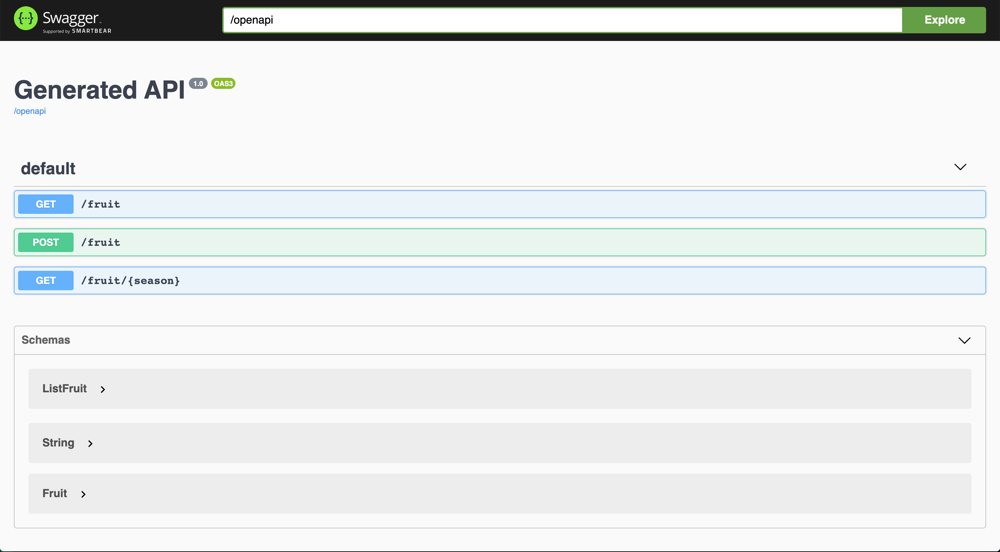
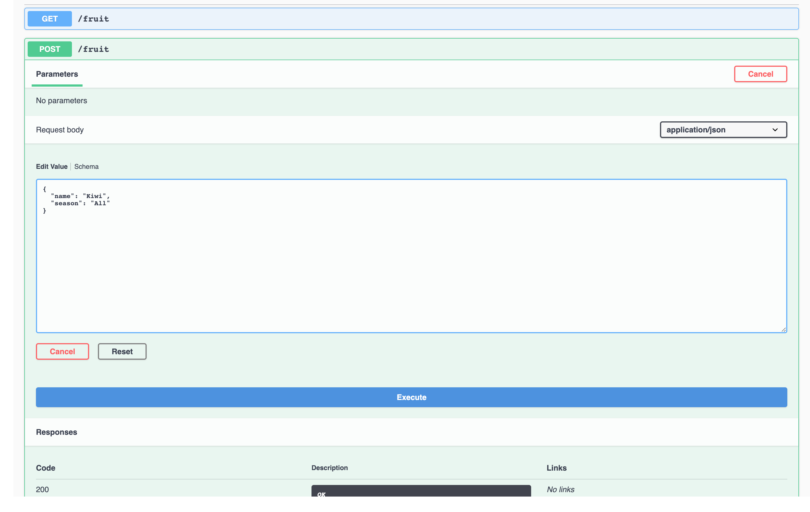
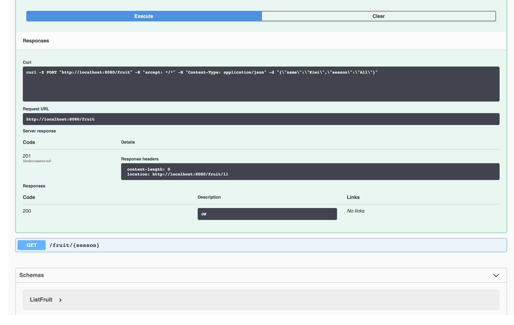
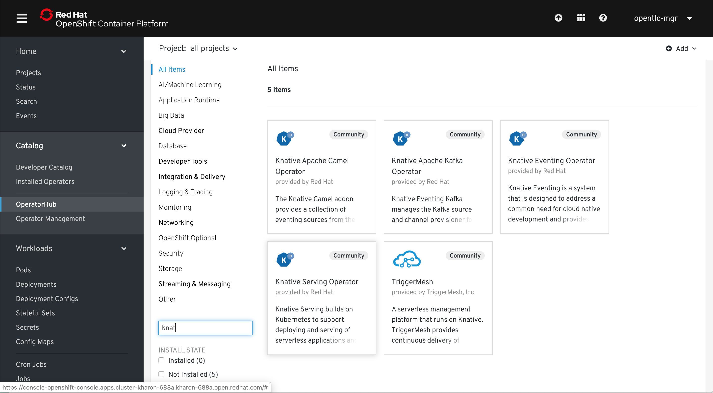
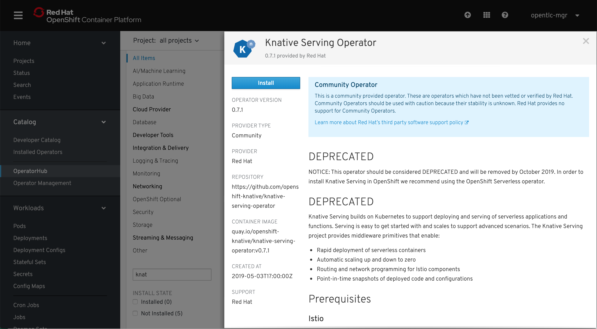
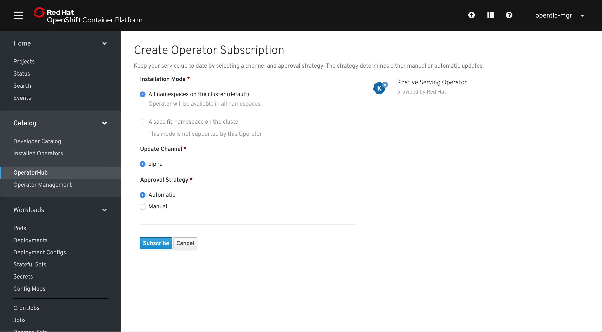
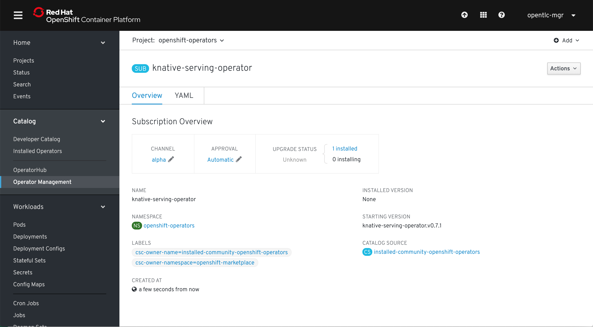
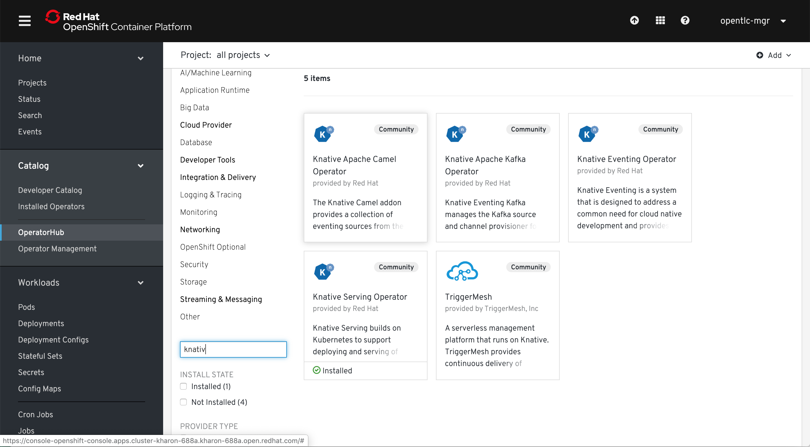
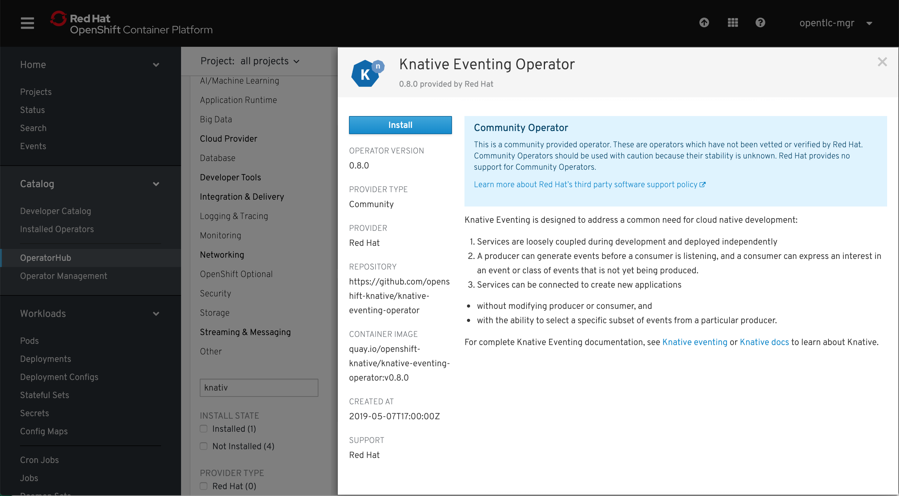
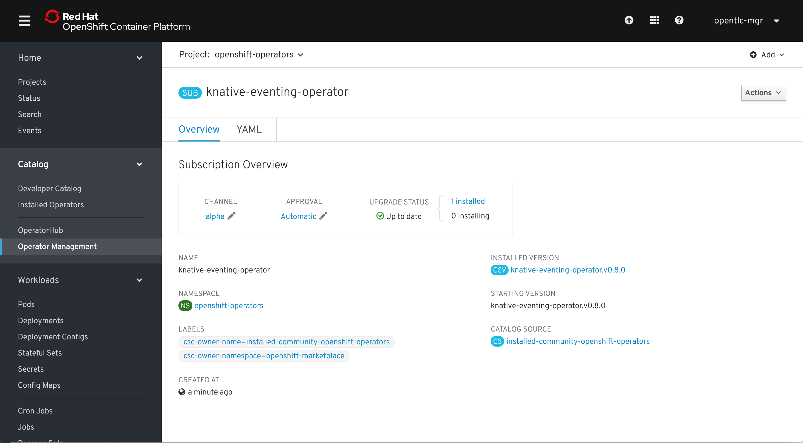

# Atomic Fruit Service

This is sample Fruit service generated from a maven artifact that generates all the needed Java scaffold for a Quarkus Maven app.

> Don't worry, there's also a Gradle counterpart ;-)

# Prerequisites

> **NOTE 1:** Change to the cloned folder.

> **NOTE 2:** You need JDK 8 or 11

## Setting demo environment variables

> *You can alternatively run:* `$ . ./env.sh`

```sh
export PROJECT_NAME="atomic-fruit"
export APP_NAME="fruits-app"

export QUARKUS_VERSION="1.8.1.Final"

export GRAALVM_VERSION="20.2.0"
GRAALVM_HOME=$(pwd)/graalvm-ce-java11-${GRAALVM_VERSION}
if [[ "$OSTYPE" == "darwin"* ]]; then GRAALVM_HOME=${GRAALVM_HOME}/Contents/Home ; fi
export GRAALVM_HOME
export PATH=${GRAALVM_HOME}/bin:$PATH

if [[ "$OSTYPE" == "linux"* ]]; then GRAALVM_OSTYPE=linux ; fi
if [[ "$OSTYPE" == "darwin"* ]]; then GRAALVM_OSTYPE=darwin ; fi
export GRAALVM_OSTYPE

export KNATIVE_CLI_VERSION="0.17.0"
if [[ "$OSTYPE" == "linux"* ]]; then KNATIVE_OSTYPE=Linux ; fi
if [[ "$OSTYPE" == "darwin"* ]]; then KNATIVE_OSTYPE=Darwin ; fi
export KNATIVE_OSTYPE

export TEKTON_CLI_VERSION="0.13.0"
if [[ "$OSTYPE" == "linux"* ]]; then TEKTON_OSTYPE=Linux ; fi
if [[ "$OSTYPE" == "darwin"* ]]; then TEKTON_OSTYPE=Darwin ; fi
export TEKTON_OSTYPE

mkdir -p ./bin
export PATH=$(pwd)/bin:$PATH
```

## Download GraalVM and set GraaVM env

Now download GraalVM for your system...

```sh
curl -OL https://github.com/graalvm/graalvm-ce-builds/releases/download/vm-${GRAALVM_VERSION}/graalvm-ce-java11-${GRAALVM_OSTYPE}-amd64-${GRAALVM_VERSION}.tar.gz
tar xvzf graalvm-ce-java11-${GRAALVM_OSTYPE}-amd64-${GRAALVM_VERSION}.tar.gz
```

## Install native image for GraalVM

```sh
gu install native-image
```

## Login to your Openshift cluster

```sh
oc login ...
```

## Create a project or use an already existing one

```sh
oc new-project ${PROJECT_NAME}
```

# Generate the Quarkus app scaffold using a maven archetype

```sh
mvn io.quarkus:quarkus-maven-plugin:$QUARKUS_VERSION:create \
  -DprojectGroupId="com.redhat.atomic.fruit" \
  -DprojectArtifactId="atomic-fruit-service" \
  -DprojectVersion="1.0-SNAPSHOT" \
  -DclassName="FruitResource" \
  -Dpath="fruit"
```

# Testing different ways of packaging the app

> You must be inside the project folder to run the following commands.

```sh
cd atomic-fruit-service
```

## JVM mode

This mode generates a Quarkus Java jar file.

```sh
./mvnw -DskipTests clean package
```

Run the application in JVM mode.

```sh
java -jar ./target/atomic-fruit-service-1.0-SNAPSHOT-runner.jar
```

Test from another terminal or a browser, you should receive a `hello` string.

```sh
curl http://localhost:8080/fruit
```

Ctrl+C to stop.

## Native Mode

This mode generates a Quarkus native binary file.

> **NOTE:** This is huge... now you have a native binary file, no JVM involved.

```sh
./mvnw -DskipTests clean package -Pnative
```

Run the application in native mode.

```sh
./target/atomic-fruit-service-1.0-SNAPSHOT-runner
```

Test from another terminal or a browser, you should receive a `hello` string.

```sh
curl http://localhost:8080/fruit
```

Ctrl+C to stop.

## Docker-Native Mode

This mode generates a Quarkus native binary file using an image and builds an image with it.

> **NOTE:** If you want to use Mandrel...
> 
> ```
> ./mvnw package -Pnative -Dquarkus.native.container-build=true -Dquarkus.native.builder-image=quay.io/quarkus/ubi-quarkus-mandrel:{mandrel-flavor}
> ```

```sh
./mvnw package -DskipTests -Pnative -Dquarkus.native.container-build=true
docker build -f src/main/docker/Dockerfile.native -t atomic-fruit-service:1.0-SNAPSHOT .
```

Run the image created.

```sh
docker run -i --rm -p 8080:8080 atomic-fruit-service:1.0-SNAPSHOT
```

Test from another terminal or a browser, you should receive a `hello` string.

```sh
curl http://localhost:8080/fruit
```

Ctrl+C to stop.

Push it to the image registry of your choice.

```sh
docker tag atomic-fruit-service:1.0-SNAPSHOT quay.io/<quay_user>/atomic-fruit-service:1.0-SNAPSHOT
docker push quay.io/<quay_user>/atomic-fruit-service:1.0-SNAPSHOT
```

# [OPTIONAL] Docker-Native Mode 1 step

> **NOTE:** Extentions for building images [here](https://quarkus.io/guides/container-image)

```
./mvnw quarkus:add-extension -Dextensions="container-image-docker"
./mvnw package -Pnative -Dquarkus.native.container-build=true -Dquarkus.container-image.build=true
```

Run the image created.

```sh
docker run -i --rm -p 8080:8080 atomic-fruit-service:1.0-SNAPSHOT
```

Test from another terminal or a browser, you should receive a `hello` string.

```sh
curl http://localhost:8080/fruit
```

Ctrl+C to stop.


# [OPTIONAL] Docker-JVM Mode 1 step

> **NOTE:** Extentions for building images [here](https://quarkus.io/guides/container-image)

```
./mvnw quarkus:add-extension -Dextensions="container-image-docker"
./mvnw package -Dquarkus.native.container-build=true -Dquarkus.container-image.build=true
```

Run the image created.

```sh
docker run -i --rm -p 8080:8080 atomic-fruit-service:1.0-SNAPSHOT
```

Test from another terminal or a browser, you should receive a `hello` string.

```sh
curl http://localhost:8080/fruit
```

Ctrl+C to stop.

# Adding log capabilities

You can configure Quarkus logging by setting the following parameters to `$PROJECT_HOME/src/main/resources/application.properties`:

```properties
# Enable logging
quarkus.log.console.enable=true
quarkus.log.console.level=DEBUG

# Log level settings
quarkus.log.category."com.redhat.atomic".level=DEBUG
```

Update `$PROJECT_HOME/src/main/java/com/redhat/atomic/fruit/FruitResource.java` with the relevant lines bellow.

```java
...
import org.jboss.logging.Logger; // logging

public class FruitResource {
  Logger logger = Logger.getLogger(FruitResource.class); // logging
  ...

  @GET
  @Produces(MediaType.TEXT_PLAIN)
  public String hello() {
      logger.debug("Hello method is called"); // logging
      return "hello";
  }
...
}
```

# Adding custom properties

Add the following to the class you want to use your custom property.

```java
...
import org.eclipse.microprofile.config.inject.ConfigProperty;

@Path("/fruit")
public class FruitResource {

  @ConfigProperty(name = "hello.message")
  String message;
  
  @GET
  @Produces(MediaType.TEXT_PLAIN)
  public String hello() {
      logger.debug("Hello method is called with message: " + this.message); // logging & custom property
      return message; // custom property
  }
...
}
```

Add the following property to your application.properties.

```properties
# custom properties
hello.message = ${HELLO_MESSAGE:hello}
```

# Running in development mode and enjoy hot reloading

We can run our app in development mode, to do so we have to do as follows:

> **NOTE:** In this case we're using the `dev` profile

```sh
./mvnw compile quarkus:dev
```

As we have done several times before, from a different terminal or using a browser try this url: http://localhost:8080/fruit

Now, without stopping our application, change the value of `hello.message` from hello to something different. Save the aplication.propertlies file and try again. This time the result should be different.

**WARNING:** Return the value of `hello.message` back to `hello` and stop the app with Ctrl+C

# Adding a Data Base to our application

## Deploying PostgreSQL

We're going to deploy PostgreSQL using a template, in general an operator is a better choice but for the sake of simplicity in this demo a template is a good choice.

Using `kubectl`

```sh
kubectl create ns ${PROJECT_NAME}
kubectl create deployment my-database --image=registry.access.redhat.com/rhscl/postgresql-10-rhel7:latest -n ${PROJECT_NAME}
kubectl set env deployment/my-database POSTGRESQL_USER=luke POSTGRESQL_PASSWORD=secret POSTGRESQL_DATABASE=my_data -n ${PROJECT_NAME}
kubectl expose deployment my-database --port=5432 --target-port=5432
```

Using `oc`

```sh
oc new-app -e POSTGRESQL_USER=luke -e POSTGRESQL_PASSWORD=secret -e POSTGRESQL_DATABASE=my_data centos/postgresql-10-centos7 --name=my-database -n ${PROJECT_NAME}
```

Some labeling specially useful for OpenShift developer view.

```sh
kubectl label deployment/my-database app.openshift.io/runtime=postgresql --overwrite -n ${PROJECT_NAME} && \
kubectl label deployment/my-database app.kubernetes.io/part-of=${APP_NAME} --overwrite -n ${PROJECT_NAME}
```

## Adding DB related extensions

We need some extensions to expose our database to the world: REST JSON, PostgreSQL and Panache Hibernate as our ORM.

```sh
./mvnw quarkus:add-extension -Dextension="quarkus-resteasy-jsonb, quarkus-jdbc-postgresql, quarkus-hibernate-orm-panache"
```

You should see something like this when you add succesfully extensions to an app.

```sh
...
[INFO] --- quarkus-maven-plugin:0.23.1:add-extension (default-cli) @ atomic-fruit-service ---
✅ Adding extension io.quarkus:quarkus-resteasy-jsonb
✅ Adding extension io.quarkus:quarkus-jdbc-postgresql
✅ Adding extension io.quarkus:quarkus-hibernate-orm-panache
...
```

## Let's create the `Fruit` entity

Create this file here `$PROJECT_HOME/src/main/java/com/redhat/atomic/fruit/Fruit.java`

Add this content to it.

```java
package com.redhat.atomic.fruit;

import java.util.List;

import javax.persistence.Entity;

import io.quarkus.hibernate.orm.panache.PanacheEntity;

@Entity
public class Fruit extends PanacheEntity {

    public String name;
    public String season;

    public static List<Fruit> getAllFruitsForSeason(String season) {
        return find("season", season).list();
    }
}
```

As you can see our `Fruit` class extends `PanacheEntity` which adds the default **CRUD** methods you can expects from an **ORM framework** such as **Panache**. How ever it doesn't add any custom methods. In this case we want to be able to search by season and that's the reason we have added a methos called `getAllFruitsForSeason`.

## Let's CRUDify our REST enabled service class FruitResource

What we want to do is easy:

* Return all the fruit if **GET** `/fruit`
* Save a Fruit if **POST** `/fruit`
* Search fruit if a given season if **GET** `/fruit/{season}`

```java
package com.redhat.atomic.fruit;

import java.net.URI;
import java.util.List;

import javax.transaction.Transactional;
import javax.ws.rs.Consumes;
import javax.ws.rs.GET;
import javax.ws.rs.POST;
import javax.ws.rs.Path;
import javax.ws.rs.PathParam;
import javax.ws.rs.Produces;
import javax.ws.rs.core.MediaType;
import javax.ws.rs.core.Response;
import javax.ws.rs.core.UriBuilder;

import org.eclipse.microprofile.config.inject.ConfigProperty;
import org.jboss.logging.Logger;

@Path("/fruit")
@Produces(MediaType.APPLICATION_JSON)
@Consumes(MediaType.APPLICATION_JSON)
public class FruitResource {
    Logger logger = Logger.getLogger(FruitResource.class);

    @ConfigProperty(name = "hello.message")
    String message;
    
    @GET
    @Path("hello")
    @Produces(MediaType.TEXT_PLAIN)
    public String hello() {
        logger.debug("Hello method is called with message: " + this.message); // logging & custom property
        return message; // custom property
    }
    
    @GET
    public List<Fruit> allFruits() {
        return Fruit.listAll(); 
    }

    @GET
    @Path("{season}")
    public List<Fruit> fruitsBySeason(@PathParam("season") String season) {
        return Fruit.getAllFruitsForSeason(season);
    }

    @POST
    @Transactional
    public Response saveFruit(Fruit fruit) {
        // since the FruitEntity is a panache entity
        // persist is available by default
        fruit.persist();
        final URI createdUri = UriBuilder.fromResource(FruitResource.class)
                        .path(Long.toString(fruit.id))
                        .build();
        return Response.created(createdUri).build();
    }
}
```

We need to adapt the test class after the changes to `FruitResource`. Update `$PROJECT_HOME/src/test/java/com/redhat/atomic/fruit/FruitResourceTest.java` with the next code.

```java
package com.redhat.atomic.fruit;

import io.quarkus.test.junit.QuarkusTest;
import org.junit.jupiter.api.Test;

import static io.restassured.RestAssured.given;
import static org.hamcrest.CoreMatchers.is;

@QuarkusTest
public class FruitResourceTest {

    @Test
    public void testHelloEndpoint() {
        given()
          .when().get("/fruit/hello")
          .then()
             .statusCode(200)
             .body(is("hello"));
    }

}
```

## Adding datasource related properties

Add the following properties to your `./src/main/resources/application.properties` file:

> **NOTE:** As you can see we have three different jdbc urls for three execution profiles (`dev`, `prod` the default and `che` a custom profile we'll use later)

```properties
# Data Base related properties

quarkus.datasource.jdbc.url = jdbc:postgresql://my-database:5432/my_data
#quarkus.datasource.jdbc.url = jdbc:postgresql://localhost:5432/my_data
quarkus.datasource.db-kind=postgresql

#%dev.quarkus.datasource.jdbc.url = jdbc:postgresql://localhost:5432/my_data
#%dev.quarkus.datasource.db-kind=postgresql
#%dev.quarkus.datasource.jdbc.url = jdbc:h2:mem:myDB
#%dev.quarkus.datasource.db-kind=h2
#%dev.quarkus.datasource.username = username-default

#quarkus.hibernate-orm.dialect = org.hibernate.dialect.PostgreSQL95Dialect
quarkus.datasource.username = luke
quarkus.datasource.password = secret

# drop and create the database at startup (use `update` to only update the schema)
%dev.quarkus.hibernate-orm.database.generation = drop-and-create
quarkus.hibernate-orm.database.generation = create
quarkus.hibernate-orm.sql-load-script = import.sql
# show sql statements in log
quarkus.hibernate-orm.log.sql = true
```

## Adding some fruits

Create a file called `import.sql` here `./src/main/resources`

This is a suitable content for that file.

```sql
INSERT INTO Fruit(id,name,season) VALUES ( nextval ('hibernate_sequence') , 'Mango'      , 'Spring' );
INSERT INTO Fruit(id,name,season) VALUES ( nextval ('hibernate_sequence') , 'Strawberry' , 'Spring' );
INSERT INTO Fruit(id,name,season) VALUES ( nextval ('hibernate_sequence') , 'Orange'     , 'Winter' );
INSERT INTO Fruit(id,name,season) VALUES ( nextval ('hibernate_sequence') , 'GrapeFruit' , 'Winter' );
INSERT INTO Fruit(id,name,season) VALUES ( nextval ('hibernate_sequence') , 'Blueberry'  , 'Summer' );
INSERT INTO Fruit(id,name,season) VALUES ( nextval ('hibernate_sequence') , 'Banana'     , 'Summer' );
INSERT INTO Fruit(id,name,season) VALUES ( nextval ('hibernate_sequence') , 'Plum'       , 'Summer' );
INSERT INTO Fruit(id,name,season) VALUES ( nextval ('hibernate_sequence') , 'Apple'      , 'Fall'   );
INSERT INTO Fruit(id,name,season) VALUES ( nextval ('hibernate_sequence') , 'Grape '     , 'Fall'   );
```

## Testing locally using port-forwarding

In a different terminal...

> **NOTE 1:** Load environment as we did before `. ./env.sh` or just substitute `PROJECT_NAME` accordingly
> **NOTE 2:** If using `oc` you may want to set the default project to ${PROJECT_NAME}: `oc project ${PROJECT_NAME}`

```sh
POD_NAME=$(kubectl get pod -n ${PROJECT_NAME} -o jsonpath='{.items[0].metadata.name}')
kubectl port-forward ${POD_NAME} 5432
```

In your current terminal run your code using profile `dev`

> **NOTE 1:** When you run you're app in `dev` mode `dev` profile is activated by default.

> **NOTE 2:** Later we'll need to run `che`, we'll do it by adding: `-Dquarkus.profile=che`

```sh
./mvnw compile quarkus:dev
```

If you use another terminal and try this url: http://localhost:8080/fruit this time you should get a list of fruits.

```sh
curl http://localhost:8080/fruit
[{"id":1,"name":"Mango","season":"Spring"},{"id":2,"name":"Strawberry","season":"Spring"},{"id":3,"name":"Orange","season":"Winter"},{"id":4,"name":"GrapeFruit","season":"Winter"},{"id":5,"name":"Blueberry","season":"Summer"},{"id":6,"name":"Banana","season":"Summer"},{"id":7,"name":"Plum","season":"Summer"},{"id":8,"name":"Apple","season":"Fall"},{"id":9,"name":"Grape ","season":"Fall"}]
```

We're done with the PostgreSQL tests, now go to the terminal window where we forwaded the database port and stop it with Ctrl+C

Leave the application running we're going to do some more changes.

### Little diversion: Using H2

What if you wanted to use H2, the embedded database when in `dev` mode?

First let's add the extension.

> Adding H2

```sh
./mvnw quarkus:add-extension -Dextension="io.quarkus:quarkus-jdbc-h2"
[INFO] Scanning for projects...
[INFO] 
[INFO] ------------< com.redhat.atomic.fruit:atomic-fruit-service >------------
[INFO] Building atomic-fruit-service 1.0-SNAPSHOT
[INFO] --------------------------------[ jar ]---------------------------------
[INFO] 
[INFO] --- quarkus-maven-plugin:0.23.1:add-extension (default-cli) @ atomic-fruit-service ---
✅ Adding dependency io.quarkus:quarkus-jdbc-h2:jar
[INFO] ------------------------------------------------------------------------
[INFO] BUILD SUCCESS
[INFO] ------------------------------------------------------------------------
[INFO] Total time:  1.606 s
[INFO] Finished at: 2019-10-13T15:37:52+02:00
[INFO] ------------------------------------------------------------------------
```

Second, change some datasource related properties in `application.properties`

> **Notice** that we have changed the value of `dev.quarkus.datasource.url` now the url points to H2 instead of PostgreSQL, so no need to port-forward our DB running in our cluster.

```
#%dev.quarkus.datasource.url = jdbc:postgresql://127.0.0.1:5432/my_data
%dev.quarkus.datasource.url=jdbc:h2:mem:myDB
%dev.quarkus.datasource.driver=org.h2.Driver
%dev.quarkus.datasource.username=username-default
```

If, accidentally, you stopped the application you can run it again using profile `dev` running the next command. However this time the application will run queries against H2.

```sh
./mvnw compile quarkus:dev
```

As we have done before, from another terminal run:

```sh
curl http://localhost:8080/fruit
[{"id":1,"name":"Mango","season":"Spring"},{"id":2,"name":"Strawberry","season":"Spring"},{"id":3,"name":"Orange","season":"Winter"},{"id":4,"name":"GrapeFruit","season":"Winter"},{"id":5,"name":"Blueberry","season":"Summer"},{"id":6,"name":"Banana","season":"Summer"},{"id":7,"name":"Plum","season":"Summer"},{"id":8,"name":"Apple","season":"Fall"},{"id":9,"name":"Grape ","season":"Fall"}]
```

## Test creating a fruit

Let's try to create a Fruit object in our database.

```sh
curl -vvv -d '{"name": "banana", "season": "summer"}' -H "Content-Type: application/json" POST http://localhost:8080/fruit
* Rebuilt URL to: POST/
* Could not resolve host: POST
* Closing connection 0
curl: (6) Could not resolve host: POST
*   Trying ::1...
* TCP_NODELAY set
* Connected to localhost (::1) port 8080 (#1)
> POST /fruit HTTP/1.1
> Host: localhost:8080
> User-Agent: curl/7.54.0
> Accept: */*
> Content-Type: application/json
> Content-Length: 38
> 
* upload completely sent off: 38 out of 38 bytes
< HTTP/1.1 201 Created
< Location: http://localhost:8080/fruit/1
< Content-Length: 0
< 
* Connection #1 to host localhost left intact
```

## Adding Swagger UI to ease API development and testing

You can easily generate en OpenAPI compliant description of your API and at additionally add a Swagger UI to your app by adding the `openapi` extension. Please run this command to do so.

```sh
./mvnw quarkus:add-extension -Dextensions="quarkus-smallrye-openapi"
```

Try opening this url http://localhost:8080/swagger-ui with a browser you should see something like:



## Try creating another Fruit this time with the Swagger UI

Try to create a new fruit, get all and get by season.

Click on **POST /fruit** then click on **Try it out**

> **WARNING:** Don't forget to delete the `id` property when creating a new fruit because `id` is self-generated.



Now click on **Execute** eventually you should get a result similar to this one.

> Pay attention to **Code**, it should be **201**.



## Adding health checks

Health checks is one of those things that if recommendable in general is a must for every Cloud Native App and in quarkus it's a extension so let's add it.

```sh
./mvnw quarkus:add-extension -Dextension="smallrye-health"
```

Make sure your application is running in `dev` mode, then test the `/health` endpoint like this:

```sh
curl http://localhost:8080/health

{
    "status": "UP",
    "checks": [
        {
            "name": "Database connections health check",
            "status": "UP"
        }
    ]
}
```

Ctrl+C

# Different deployment techniques

## Deploying to Kubernetes

First of all let's add the extension to deploy to kubernetes.

```sh
./mvnw quarkus:add-extension -Dextension="kubernetes, jib"
```

Add this couple of properties to `application.properties` so that we trust on the CA cert and set the namespace where we want to deploy our application.

```properties
# Kubernetes Client
quarkus.kubernetes-client.trust-certs=true
quarkus.kubernetes-client.namespace=${PROJECT_NAME:atomic-fruit}
```

Additionally, we want to use `jib` to build the image so it's better to specifically set this up as follows. Otherwise if you had installed other `container-image-*` extension you would get this error.

> ERROR:
>
> ```sh
> [error]: Build step io.quarkus.container.image.deployment.ContainerProcessor#publishImageInfo threw an exception: java.lang IllegalStateException: quarkus-container-image-jib and quarkus-container-image-docker were detected, at most one container-image extension can be present.
> ```
>

Add this property to the `application.properties` file.

```properties
# Choose your building extension
quarkus.container-image.builder=jib
```

Let's package our application and have a look to the kuberenetes descriptors generated.

```
./mvnw package
```

Go to [`./target/kubernetes/kubernetes.yml`](./target/kubernetes/kubernetes.yml) there you'll find three objects: ServiceAccoount, Service and Deployment. Focus on the Deployment object, pay attention to the `spec/template/spec/containers[0]/image` it points to `<YOUR-DOCKER-USER>/atomic-fruit-service:1.0-SNAPSHOT`, right? You can change this and point to the registry you pushed your image to, `quai.io` in my case, and the registry user you want to use, `cvicens` in this case.

```properties
# OCI Image
quarkus.container-image.registry=quay.io
quarkus.container-image.group=cvicens
```

There're other properties you can use if necessary:

```properties
quarkus.container-image.group=user    #optional, default to the system user name
quarkus.container-image.name=demo-app #optional, defaults to the application name
quarkus.container-image.tag=1.0       #optional, defaults to the application version
```

The generated manifests use the Kubernetes recommended labels. These labels can be customized using quarkus.kubernetes.name, quarkus.kubernetes.version and quarkus.kubernetes.part-of. For example by adding the following configuration to your application.properties:

```properties
quarkus.kubernetes.part-of=todo-app
quarkus.kubernetes.name=todo-rest
quarkus.kubernetes.version=1.0-rc.1
```

As is described in detail in the OpenShift section, customizing OpenShift (or Knative) properties is done in the same way, but replacing kubernetes with openshift (or knative). The previous example for OpenShift would look like this:

```properties
quarkus.openshift.part-of=todo-app
quarkus.openshift.name=todo-rest
quarkus.openshift.version=1.0-rc.1
```

Let's add a some additional labels `part-of` and `name`, and a custom label:

```properties
quarkus.kubernetes.part-of=fruits-app
quarkus.kubernetes.name=quarkus
quarkus.kubernetes.labels.foo=bar
```

> **NOTE:**
> When using the quarkus-container-image-jib extension to build a container image, then any label added via the aforementioned property will also be added to the generated container image.

Regarding annotations, out of the box, the generated resources will be annotated with version control related information that can be used either by tooling, or by the user for troubleshooting purposes.

```yaml
annotations:
  app.quarkus.io/vcs-url: "<some url>"
  app.quarkus.io/commit-id: "<some git SHA>"
```

Let's add a custom annotation:

```properties
quarkus.kubernetes.annotations.foo=bar
quarkus.kubernetes.annotations."app.quarkus/id"=42
```

Now let's add the environment variables we need to connect to the database:

```properties
# Environment variables
quarkus.kubernetes.env.vars.DB_USERNAME=luke
quarkus.kubernetes.env.vars.DB_PASSWORD=secret
```

Let's add a custom resource, an ingress rule, that points and should expose the Service generated for our Deployment.

```sh
cat << EOF > ./src/main/kubernetes/kubernetes.yml
apiVersion: networking.k8s.io/v1beta1
kind: Ingress
metadata:
  name: atomic-fruit-service
spec:
  rules:
    - host: fruits.minikube.local
      http:
        paths:
          - path: /
            pathType: Prefix
            backend:
              serviceName: atomic-fruit-service
              servicePort: 8080
EOF
```

Install (enable if you prefer) nginx ingress controller in minikube.

```sh
minikube addons enable ingress
```

Let's generate the kubernetes descriptors and have a look to all the changes added.

```sh
./mvnw clean package
```

Let's deploy the result.

```sh
./mvnw clean package -Dquarkus.kubernetes.deploy=true
```

Or

```sh
$ kubectl apply -n ${PROJECT_NAME} -f target/kubernetes/kubernetes.yml
```

Let's inspect the resources created.

```sh
$ kubectl get deploy
NAME                   READY   UP-TO-DATE   AVAILABLE   AGE
atomic-fruit-service   1/1     1            1           73s
my-database            1/1     1            1           89m
```

```sh
$ kubectl get ingress -n $PROJECT_NAME 
NAME                   CLASS    HOSTS                   ADDRESS         PORTS   AGE
atomic-fruit-service   <none>   fruits.minikube.local   192.168.64.12   80      39s
```

Get the IP of your minikube cluster.

```sh
$ minikube ip
192.168.64.12
```

And update your hosts file accordingly.

```
192.168.64.12   fruits.minikube.local
```

Now we can test that everything works properly.

```sh
curl http://fruits.minikube.local/fruit
```

## Deploying to OpenShift

Let's add the `openshift` extension, it also adds the `s2i` build extension

```sh
 ./mvnw quarkus:add-extension -Dextensions="openshift"
```

Add these properties to select OpenShift as target, expose the application using a route and add an annotation to `connect` the application to the database.

```
# OpenShift Deployment
quarkus.kubernetes.deployment-target=openshift
quarkus.openshift.expose=true
quarkus.openshift.labels.app.openshift.io/runtime=quarkus
quarkus.openshift.annotations."app.openshift.io/connects-to"=my-database
```

Additionally let's select `s2i` as the image builder option. This way you'll be leveraging binary source to image (`s2i`).

> **NOTE:** Should you want to select a different s2i base image you can do it using this property `quarkus.s2i.base-jvm-image=fabric8/s2i-java:3.1-java11`

```properties
# Choose your building extension
quarkus.container-image.builder=s2i
```

Let's deploy our application on OpenShift. Don't forget to log in to your OpenShift cluster first!

```sh
./mvnw clean package -DskipTests -Dquarkus.kubernetes.deploy=true
```

### Local native compilation and S2I binary build 

In this case we create a binary BuildConfig, compile the to native Linux x64 and start a build with that file.

> **NOTE:** For this to work you should be runnint Linux on your laptop... otherwise the local native executable file won't work in the linux image ;-)

```sh
./mvnw clean package -DskipTests -Dquarkus.kubernetes.deploy=true -Pnative
```

Another... more manual way to do the same this time using a container for building the native version.

```sh
oc new-project ${PROJECT_NAME}-native

oc new-app -e POSTGRESQL_USER=luke -e POSTGRESQL_PASSWORD=secret -e POSTGRESQL_DATABASE=my_data centos/postgresql-10-centos7 --name=my-database -n ${PROJECT_NAME}-native

kubectl label deployment/my-database app.openshift.io/runtime=postgresql --overwrite -n ${PROJECT_NAME}-native && \
kubectl label deployment/my-database app.kubernetes.io/part-of=${APP_NAME} --overwrite -n ${PROJECT_NAME}-native

oc new-build quay.io/quarkus/ubi-quarkus-native-binary-s2i:1.0 --binary --name=atomic-fruit-service-native-bin -l app=atomic-fruit-service-native-bin -n ${PROJECT_NAME}-native
./mvnw package -DskipTests -Pnative -Dquarkus.native.container-build=true
oc start-build atomic-fruit-service-native-bin --from-file=./target/atomic-fruit-service-1.0-SNAPSHOT-runner --follow -n ${PROJECT_NAME}-native
oc new-app atomic-fruit-service-native-bin --name atomic-fruit-service-native-bin -n ${PROJECT_NAME}-native
oc expose svc/atomic-fruit-service-native-bin -n ${PROJECT_NAME}-native

oc label deployment/atomic-fruit-service-native-bin app.openshift.io/runtime=quarkus --overwrite -n ${PROJECT_NAME}-native
oc label deployment/atomic-fruit-service-native-bin app.kubernetes.io/part-of=${APP_NAME} --overwrite -n ${PROJECT_NAME}-native
oc annotate deployment/atomic-fruit-service-native-bin app.openshift.io/connects-to=my-database --overwrite -n ${PROJECT_NAME}-native
```

### Building an image starting with a git repo using S2I

So this time instead of a binary file we will instruct S2I to build an image starting from the source code.

#### [OPTIONAL] Building an image locally using S2I

> **This step is optional and requires you have installed `s2i`**, you can find he binary [here](https://github.com/openshift/source-to-image/releases).

```
$ s2i build . quay.io/quarkus/ubi-quarkus-native-s2i:${GRAALVM_VERSION}-java11 --context-dir=. atomic-fruit-service
```

If you need or want to to look at the log, you can also do the following,

```sh
$ docker logs $(docker ps | grep quay.io/quarkus/ubi-quarkus-native-s2i:${GRAALVM_VERSION} | awk -F ' ' '{print $1}')
```

Would you like to run the image generated locally? With the next command you get the location of the script that will be run as `ENTRYPOINT`.

```sh
$ export ENTRYPOINT=$(docker inspect --format='{{ index .Config.Labels "io.openshift.s2i.scripts-url" }}' quay.io/quarkus/ubi-quarkus-native-s2i:${GRAALVM_VERSION}-java11)
```

Now you can run the image locally with:

```
$ docker run -it --rm -p 8080 atomic-fruit-service ${ENTRYPOINT}
```

#### Building the same image using S2I on Openshift

But the truth is that you don't need to tun `s2i` locally... you would usually use S2I on Openshift. As follows:

> **NOTE:** Creating a Quarkus native binary requires some memory, maybe you need to either adapt your LimitRange (if there's any) or simply delete it (if this is suitable in your case) as in here: `oc delete limitrange --all -n ${PROJECT_NAME}-native`

```sh
oc new-app quay.io/quarkus/ubi-quarkus-native-s2i:${GRAALVM_VERSION}-java11~https://github.com/cvicens/atomic-fruit-service --context-dir=. --name=atomic-fruit-service-native -n ${PROJECT_NAME}-native

oc label deployment/atomic-fruit-service-native app.openshift.io/runtime=quarkus --overwrite -n ${PROJECT_NAME}-native && \
oc label deployment/atomic-fruit-service-native app.kubernetes.io/part-of=${APP_NAME} --overwrite -n ${PROJECT_NAME}-native && \
oc annotate deployment/atomic-fruit-service-native app.openshift.io/connects-to=fruits-database --overwrite -n ${PROJECT_NAME}-native
```

> You may need to add resources to the BuildConfig

```
spec:
  resources:
    limits:
      cpu: "1500m" 
      memory: "9Gi"
```

You can monitor the status of the build with:

```sh
oc logs -f bc/atomic-fruit-service-native -n ${PROJECT_NAME}
```

Once the build has succeded...

```sh
...
Writing manifest to image destination
Storing signatures
Push successful
```

Just because you use S2I to create a new app (hence building the image) your app (its service actually) is not exposed. Let's expose it:

```sh
oc expose svc/atomic-fruit-service-native -n ${PROJECT_NAME}
```

Now we can try our Quarkus native app from the Internet ;-)

```sh
curl http://$(oc get route atomic-fruit-service-native | awk 'NR > 1 { print $2 }')/fruit
```

You should the the same results as before.

> Swagger UI is not available because by default is available only in `dev` mode.

# Creating a Tekton Pipeline to Build and Deploy our app

This part of the guide is explained in more detail in the [OpenShift Pipelines Tutorial](https://github.com/openshift/pipelines-tutorial)

## Preprequisites

### Install Knative CLI

```sh
curl -L https://github.com/knative/client/releases/download/v${KNATIVE_CLI_VERSION}/kn-${GRAALVM_OSTYPE}-amd64  -o ./bin/kn
chmod u+x ./bin/kn
kn version
```

### Install Tekton CLI

```sh
curl -LO https://github.com/tektoncd/cli/releases/download/v${TEKTON_CLI_VERSION}/tkn_${TEKTON_CLI_VERSION}_${TEKTON_OSTYPE}_x86_64.tar.gz
tar xvzf tkn_${TEKTON_CLI_VERSION}_${TEKTON_OSTYPE}_x86_64.tar.gz -C $(pwd)/bin tkn
tkn version
```

### Install OpenShift Pipelines

https://github.com/openshift/pipelines-tutorial/blob/master/install-operator.md

### Adjusting security configuration

Building container images using build tools such as S2I, Buildah, Kaniko, etc require privileged access to the cluster. OpenShift default security settings do not allow privileged containers unless specifically configured. Create a service account for running pipelines and enable it to run privileged pods for building images:

```sh
oc create serviceaccount pipeline -n ${PROJECT_NAME}
oc adm policy add-scc-to-user privileged -z pipeline -n ${PROJECT_NAME}
oc adm policy add-role-to-user edit -z pipeline -n ${PROJECT_NAME}
```

## Create tasks

```sh
oc apply -f https://raw.githubusercontent.com/cvicens/atomic-fruit-service/master/src/main/k8s/openshift-deploy-app-task.yaml -n ${PROJECT_NAME}
oc apply -f https://raw.githubusercontent.com/cvicens/atomic-fruit-service/master/src/main/k8s/s2i-quarkus-task.yaml -n ${PROJECT_NAME}
```

Check that our tasks are there.

```sh
tkn tasks list
NAME               AGE
openshift-client   35 minutes ago
s2i-quarkus        6 minutes ago
```

## Create a pipeline with those tasks

Create a pipeline by running the next command.

```sh
oc apply -f https://raw.githubusercontent.com/cvicens/atomic-fruit-service/master/src/main/k8s/atomic-fruit-service-build-pipeline.yaml -n ${PROJECT_NAME}
oc apply -f https://raw.githubusercontent.com/cvicens/atomic-fruit-service/master/src/main/k8s/atomic-fruit-service-deploy-pipeline.yaml -n ${PROJECT_NAME}
```

Let's see if our pipeline is where it should be.

```sh
$ tkn pipeline list
NAME                                   AGE              LAST RUN                                         STARTED        DURATION     STATUS
atomic-fruit-service-build-pipeline    11 seconds ago   ---                                              ---            ---          ---
atomic-fruit-service-deploy-pipeline   1 day ago        atomic-fruit-service-deploy-pipeline-run-bd2hd   23 hours ago   9 minutes    Succeeded
```

## Triggering a pipeline

Triggering pipelines is an area that is under development and in the next release it will be possible to be done via the OpenShift web console and Tekton CLI. In this tutorial, you will trigger the pipeline through creating the Kubernetes objects (the hard way!) in order to learn the mechanics of triggering.

First, you should create a number of PipelineResources that contain the specifics of the Git repository and image registry to be used in the pipeline during execution. Expectedly, these are also reusable across multiple pipelines.

```sh
oc apply -f https://raw.githubusercontent.com/cvicens/atomic-fruit-service/master/src/main/k8s/atomic-fruit-service-resources.yaml -n ${PROJECT_NAME}
```
List those resources we've just created.

```sh
$ tkn resources list
NAME                         TYPE    DETAILS
atomic-fruit-service-git     git     url: https://github.com/cvicens/atomic-fruit-service
atomic-fruit-service-image   image   url: image-registry.openshift-image-registry.svc:5000/atomic-fruit/atomic-fruit-service
```

Now it's time to actually trigger the pipeline.

> **NOTE 1:** you may need to delete or tune limit in your namespace as in `oc delete limitrange --all -n ${PROJECT_NAME}`
> **NOTE 2:** The `-r` flag specifies the PipelineResources that should be provided to the pipeline and the `-s` flag specifies the service account to be used for running the pipeline finally `-p` is for parameters.


Let's trigger a quarkus native build using a Tekton pipeline.

```sh
$ tkn pipeline start atomic-fruit-service-build-pipeline \
        -r app-git=atomic-fruit-service-git \
        -r app-image=atomic-fruit-service-image \
        -p APP_NAME=atomic-fruit-service \
        -p NAMESPACE=${PROJECT_NAME} \
        -s pipeline

Pipelinerun started: atomic-fruit-service-build-pipeline-run-piu8y

In order to track the pipelinerun progress run:
tkn pipelinerun logs atomic-fruit-service-build-pipeline-run-piu8y -f -n ${PROJECT_NAME}
```

Now let's deploy our app as a normal DeployConfig using a S2I task in a Tekton pipeline.

```sh
$ tkn pipeline start atomic-fruit-service-deploy-pipeline \
        -r app-git=atomic-fruit-service-git \
        -r app-image=atomic-fruit-service-image \
        -p APP_NAME=atomic-fruit-service \
        -p NAMESPACE=${PROJECT_NAME} \
        -s pipeline

Pipelinerun started: atomic-fruit-service-deploy-pipeline-run-xdtvs

In order to track the pipelinerun progress run:
tkn pipelinerun logs atomic-fruit-service-deploy-pipeline-run-xdtvs -f -n ${PROJECT_NAME}
```

After a success in the prevous pipeline run you should be able to test our app.

```sh
curl http://$(oc get route atomic-fruit-service | awk 'NR > 1 { print $2 }')/fruit
```

Again, the result should be the same.

# Going a step beyond, going serverless

## Preprequisites

https://redhat-developer-demos.github.io/knative-tutorial/knative-tutorial-basics/0.7.x/01-setup.html

### Install the Knative Serving

Go to `Catalog->Operatorhub` and look for `knative` you should get results similar to these ones. Click on Knative Serving Operator.



Now click on `Install` to install the Serving part of Knative.



As you see in the next picture this operator is installed cluster-wide. Click on `Subscribe` in order to install the operator. 



After some minutes you'll see how the operator status moves from `1 Installing` to `1 Installed` as in the next pic.



Check all is good.

```sh
$ oc get pod -n knative-serving
NAME                                         READY   STATUS    RESTARTS   AGE
activator-589784bc58-7c96f                   1/1     Running   0          48s
autoscaler-74bb8b4657-xpf24                  1/1     Running   0          47s
controller-7c9bfbd76-7txt6                   1/1     Running   0          42s
knative-openshift-ingress-57f5bb9ccd-q6grs   1/1     Running   0          38s
networking-certmanager-6fd9dd44bb-m57jt      1/1     Running   0          42s
networking-istio-784c7c97c-q969p             1/1     Running   0          41s
webhook-798f4bc969-92mvs                     1/1     Running   0          41s
```

### Install Knative Eventing

In a similar fashion go to `Catalog->Operatorhub` and look for `knative` you should get results similar to these ones. Click on Knative Serving Operator.



Now click on `Install` to install the Eventing part of Knative.



As you see in the next picture this operator is installed cluster-wide. Click on `Subscribe` in order to install the operator. 


After some minutes you'll see how the operator status moves from `1 Installing` to `1 Installed` as in the next pic.



> **NOTE:** This could take 2 mins or so...

Check all is good.

```sh
$ oc get pod -n knative-eventing
NAME                                            READY   STATUS    RESTARTS   AGE
eventing-controller-5f84884d54-857f6            1/1     Running   0          48s
eventing-webhook-5798db889d-ss9jm               1/1     Running   0          47s
imc-controller-5dbf7dd77b-2w4ph                 1/1     Running   0          37s
imc-dispatcher-5d6c448bcb-q5km2                 1/1     Running   0          37s
in-memory-channel-controller-75c954fd67-qt2ql   1/1     Running   0          43s
in-memory-channel-dispatcher-8b7fcf4fd-l2rgm    1/1     Running   0          41s
sources-controller-578b47f948-rg7fq             1/1     Running   0          47s
```

### Adding Security Constraints

```sh
oc adm policy add-scc-to-user privileged -z default -n ${PROJECT_NAME}
oc adm policy add-scc-to-user anyuid -z default -n ${PROJECT_NAME}
```

## Deploy your app as Knative Service

Let's create a Knative service from the image we created previously.

```sh
oc apply -n ${PROJECT_NAME} -f ./src/main/k8s/atomic-fruit-knative-service-v1.yaml
```

```yaml
apiVersion: serving.knative.dev/v1alpha1
kind: Service
metadata:
  name: atomic-fruit-knative
spec:
  template:
    metadata:
      name: atomic-fruit-knative-v1
      annotations:
        # disable istio-proxy injection
        sidecar.istio.io/inject: "false"
        # Target 10 in-flight-requests per pod.
        autoscaling.knative.dev/target: "10"
    spec:
      containers:
      - #image: quay.io/cvicensa/atomic-fruit-service:1.0-SNAPSHOT
        image: image-registry.openshift-image-registry.svc:5000/atomic-fruit/atomic-fruit-service:latest
        livenessProbe:
          httpGet:
            path: /health
        readinessProbe:
          httpGet:
            path: /health

```

Get the list of revisions

```sh
$ kn revision list
NAME                      SERVICE                AGE    CONDITIONS   READY   REASON
atomic-fruit-knative-v1   atomic-fruit-knative   3d1h   3 OK / 4     True  
```

Now get the list of Knative services

```sh
$ kn service list
NAME                   URL                                                                                             GENERATION   AGE    CONDITIONS   READY   REASON
atomic-fruit-knative   http://atomic-fruit-knative.atomic-fruit.apps.cluster-kharon-688a.kharon-688a.open.redhat.com   1            3d1h   3 OK / 3     True 
```

You can also get the list of routes.

```ss
$ kn route list
NAME                   URL                                                                                             AGE    CONDITIONS   TRAFFIC
atomic-fruit-knative   http://atomic-fruit-knative.atomic-fruit.apps.cluster-kharon-688a.kharon-688a.open.redhat.com   3d1h   3 OK / 3     100% -> atomic-fruit-knative-v1
```

Finally you can see that behind Knative there are k8s native objects such as `Deployments`.

```sh
$ oc get deployments -n ${PROJECT_NAME}
NAME                                 READY   UP-TO-DATE   AVAILABLE   AGE
atomic-fruit-service-v1-deployment   0/1     1            0           22s
```

```sh
export SVC_URL=`oc get rt atomic-fruit-knative -o yaml | yq -r .status.url` && http "$SVC_URL/fruit/welcome"
```

Let's put our service under siege! c > 10 ==> scale up

```sh
siege -r 50 -c 25 "${SVC_URL}/fruit/Summer"
```

Let's generate a second revision of the knative service `atomic-fruit-service`

```sh
oc apply -n ${PROJECT_NAME} -f ./src/main/k8s/atomic-fruit-knative-service-v2.yaml
```

```yaml
apiVersion: serving.knative.dev/v1alpha1
kind: Service
metadata:
  name: atomic-fruit-knative
spec:
  template:
    metadata:
      name: atomic-fruit-knative-v2
      annotations:
        # disable istio-proxy injection
        sidecar.istio.io/inject: "false"
        # Target 10 in-flight-requests per pod.
        autoscaling.knative.dev/target: "10"
    spec:
      containers:
      - #image: quay.io/cvicensa/atomic-fruit-service:1.0-SNAPSHOT
        image: image-registry.openshift-image-registry.svc:5000/atomic-fruit/atomic-fruit-service:latest
        env:
        - name: WELCOME_MESSAGE
          value: Bienvenido
        livenessProbe:
          httpGet:
            path: /health
        readinessProbe:
          httpGet:
            path: /health

```
