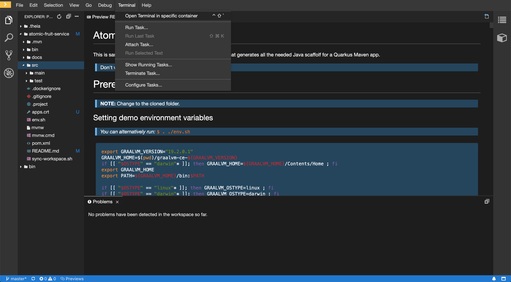
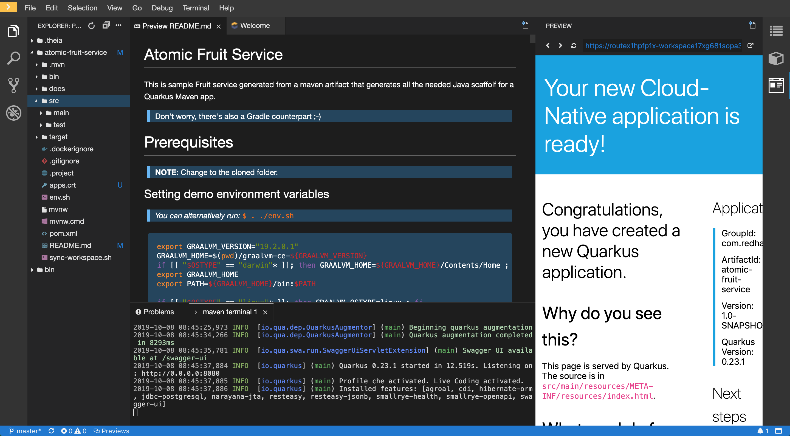

# Atomic Fruit Service

This is sample Fruit service generated from a maven artifact that generates all the needed Java scaffold for a Quarkus Maven app.

> Don't worry, there's also a Gradle counterpart ;-)

# Prerequisites

> **NOTE:** Change to the cloned folder.

## Setting demo environment variables

> *You can alternatively run:* `$ . ./env.sh`

```sh
export PROJECT_NAME="atomic-fruit"

export GRAALVM_VERSION="19.2.0.1"
GRAALVM_HOME=$(pwd)/graalvm-ce-${GRAALVM_VERSION}
if [[ "$OSTYPE" == "darwin"* ]]; then GRAALVM_HOME=${GRAALVM_HOME}/Contents/Home ; fi
export GRAALVM_HOME
export PATH=${GRAALVM_HOME}/bin:$PATH

if [[ "$OSTYPE" == "linux"* ]]; then GRAALVM_OSTYPE=linux ; fi
if [[ "$OSTYPE" == "darwin"* ]]; then GRAALVM_OSTYPE=darwin ; fi
export GRAALVM_OSTYPE

export KNATIVE_CLI_VERSION="0.2.0"
if [[ "$OSTYPE" == "linux"* ]]; then KNATIVE_OSTYPE=Linux ; fi
if [[ "$OSTYPE" == "darwin"* ]]; then KNATIVE_OSTYPE=Darwin ; fi
export KNATIVE_OSTYPE

export TEKTON_CLI_VERSION="0.4.0"
if [[ "$OSTYPE" == "linux"* ]]; then TEKTON_OSTYPE=Linux ; fi
if [[ "$OSTYPE" == "darwin"* ]]; then TEKTON_OSTYPE=Darwin ; fi
export TEKTON_OSTYPE

mkdir ./bin
export PATH=$(pwd)/bin:$PATH
```

## Download GraalVM and set GraaVM env

Now download GraalVM for your system...

```sh
curl -OL https://github.com/oracle/graal/releases/download/vm-${GRAALVM_VERSION}/graalvm-ce-${GRAALVM_OSTYPE}-amd64-${GRAALVM_VERSION}.tar.gz
tar xvzf graalvm-ce-${GRAALVM_OSTYPE}-amd64-${GRAALVM_VERSION}.tar.gz
```

## Install native image for GraalVM

```sh
gu install native-image
```

## Login to your Openshift cluster

```sh
oc login ...
```

## Create a project or use an already existing one

```sh
oc new-project atomic-fruit
```

# Generate the Quarkus app scaffold using a maven archetype

```sh
mvn io.quarkus:quarkus-maven-plugin:$QUARKUS_VERSION:create \
  -DprojectGroupId="com.redhat.atomic.fruit" \
  -DprojectArtifactId="atomic-fruit-service" \
  -DprojectVersion="1.0-SNAPSHOT" \
  -DclassName="FruitResource" \
  -Dpath="fruit"
```

# Testing different ways of packaging the app

> You must be inside the project folder to run the following commands.

```sh
cd atomic-fruit-service
```

## JVM mode

This mode generates a Quarkus Java jar file.

```sh
./mvnw -DskipTests clean package
```

Run the application in JVM mode.

```sh
java -jar ./target/atomic-fruit-service-1.0-SNAPSHOT-runner.jar
```

Test from another terminal or a browser, you should receive a `hello` string.

```sh
curl http://localhost:8080/fruit
```

Ctrl+C to stop.

## Native Mode

This mode generates a Quarkus native binary file.

> **NOTE:** This is huge... now you have a native binary file, no JVM involved.

```sh
./mvnw -DskipTests clean package -Pnative
```

Run the application in native mode.

```sh
./target/atomic-fruit-service-1.0-SNAPSHOT-runner
```

Test from another terminal or a browser, you should receive a `hello` string.

```sh
curl http://localhost:8080/fruit
```

Ctrl+C to stop.

## Docker-Native Mode

This mode generates a Quarkus native binary file using an image and builds an image with it.

```sh
./mvnw package -DskipTests -Pnative -Dnative-image.docker-build=true
docker build -f src/main/docker/Dockerfile.native -t atomic-fruit-service:1.0-SNAPSHOT .
```

Run the image created.

```sh
docker run -it --rm -p 8080:8080 atomic-fruit-service:1.0-SNAPSHOT
```

Test from another terminal or a browser, you should receive a `hello` string.

```sh
curl http://localhost:8080/fruit
```

Ctrl+C to stop.

Push it to the image registry of your choice.

```sh
docker tag atomic-fruit-service:1.0-SNAPSHOT quay.io/<quay_user>/atomic-fruit-service:1.0-SNAPSHOT
docker push quay.io/<quay_user>/atomic-fruit-service:1.0-SNAPSHOT
```

# Adding log capabilities

You can configure Quarkus logging by setting the following parameters to `$PROJECT_HOME/src/main/resources/application.properties`:

```properties
# Enable logging
quarkus.log.console.enable=true
quarkus.log.console.level=DEBUG

# Log level settings
quarkus.log.category."com.redhat.atomic".level=DEBUG
```

Update `$PROJECT_HOME/src/main/java/com/redhat/atomic/fruit/FruitResource.java` with the relevant lines bellow.

```java
...
import org.jboss.logging.Logger; // logging

public class FruitResource {
  Logger logger = Logger.getLogger(FruitResource.class); // logging
  ...

  @GET
  @Produces(MediaType.TEXT_PLAIN)
  public String hello() {
      logger.debug("Hello method is called"); // logging
      return "hello";
  }
...
}
```

# Adding custom properties

Add the following to the class you want to use your custom property.

```java
...
import org.eclipse.microprofile.config.inject.ConfigProperty;

@Path("/fruit")
public class FruitResource {

  @ConfigProperty(name = "greetings.message")
  String message;
  ...
  @GET
  @Produces(MediaType.TEXT_PLAIN)
  public String hello() {
      logger.debug("Hello method is called"); // logging
      return message;
  }
...
}
```

Add the following property to your application.properties.

```properties
# custom properties
greetings.message = hello
```

# Running in development mode and enjoy hot reloading

We can run our app in development mode, to do so we have to do as follows:

> **NOTE:** In this case we're using the `dev` profile

```sh
./mvnw compile quarkus:dev
```

As we have done several times before, from a different terminal or using a browser try this url: http://localhost:8080/fruit

Now, without stopping our application, change the value of `greetings.message` from hello to something different. Save the aplication.propertlies file and try again. This time the result should be different.

Return the value of `greetings.message` back to `hello` and stop the app with Ctrl+C

# Adding a Data Base to our application

## Deploying PostgreSQL

We're going to deploy PostgreSQL using a template, in general an operator is a better choice but for the sake of simplicity in this demo a template is a good choice.

```sh
oc new-app -n ${PROJECT_NAME} -p DATABASE_SERVICE_NAME=my-database -p POSTGRESQL_USER=luke -p POSTGRESQL_PASSWORD=secret -p POSTGRESQL_DATABASE=my_data -p POSTGRESQL_VERSION=10 postgresql-persistent
```

## Adding DB related extensions

We need some extensions to expose our database to the world: REST JSON, PostgreSQL and Panache Hibernate as our ORM.

```sh
./mvnw quarkus:add-extension -Dextension="quarkus-resteasy-jsonb, quarkus-jdbc-postgresql, quarkus-hibernate-orm-panache"
```

You should see something like this when you add succesfully extensions to an app.

```sh
...
[INFO] --- quarkus-maven-plugin:0.23.1:add-extension (default-cli) @ atomic-fruit-service ---
✅ Adding extension io.quarkus:quarkus-resteasy-jsonb
✅ Adding extension io.quarkus:quarkus-jdbc-postgresql
✅ Adding extension io.quarkus:quarkus-hibernate-orm-panache
...
```

## Let's create the `Fruit` entity

Create this file here `$PROJECT_HOME/src/main/java/com/redhat/atomic/fruit/Fruit.java`

Add this content to it.

```java
package com.redhat.atomic.fruit;

import java.util.List;

import javax.persistence.Entity;

import io.quarkus.hibernate.orm.panache.PanacheEntity;

@Entity
public class Fruit extends PanacheEntity {

    public String name;
    public String season;

    public static List<Fruit> getAllFruitsForSeason(String season) {
        return find("season", season).list();
    }
}
```

As you can see our `Fruit` class extends `PanacheEntity` which adds the default **CRUD** methods you can expects from an **ORM framework** such as **Panache**. How ever it doesn't add any custom methods. In this case we want to be able to search by season and that's the reason we have added a methos called `getAllFruitsForSeason`.

## Let's CRUDify our REST enabled service class FruitResource

What we want is easy:

* Return all the fruit if **GET** `/fruit`
* Save a Fruit if **POST** `/fruit`
* Search fruit if a given season if **GET** `/fruit/{season}`

```java
package com.redhat.atomic.fruit;

import java.net.URI;
import java.util.List;

import javax.transaction.Transactional;
import javax.ws.rs.Consumes;
import javax.ws.rs.GET;
import javax.ws.rs.POST;
import javax.ws.rs.Path;
import javax.ws.rs.PathParam;
import javax.ws.rs.Produces;
import javax.ws.rs.core.MediaType;
import javax.ws.rs.core.Response;
import javax.ws.rs.core.UriBuilder;

import org.eclipse.microprofile.config.inject.ConfigProperty;
import org.jboss.logging.Logger;

@Path("/fruit")
@Produces(MediaType.APPLICATION_JSON)
@Consumes(MediaType.APPLICATION_JSON)
public class FruitResource {
    Logger logger = Logger.getLogger(FruitResource.class);

    @ConfigProperty(name = "atomic-fruit.welcome", defaultValue = "Welcome")
    String welcome;
    
    @GET
    @Path("welcome")
    @Produces(MediaType.TEXT_PLAIN)
    public String welcome() {
        logger.debug("welcome method is called");
        return welcome;
    }
    
    @GET
    public List<Fruit> allFruits() {
        return Fruit.listAll(); 
    }

    @GET
    @Path("{season}")
    public List<Fruit> fruitsBySeason(@PathParam("season") String season) {
        return Fruit.getAllFruitsForSeason(season);
    }

    @POST
    @Transactional
    public Response saveFruit(Fruit fruit) {
        // since the FruitEntity is a panache entity
        // persist is available by default
        fruit.persist();
        final URI createdUri = UriBuilder.fromResource(FruitResource.class)
                        .path(Long.toString(fruit.id))
                        .build();
        return Response.created(createdUri).build();
    }
}
```

## Adding datasource related properties

Add the following properties to your `./src/main/resources/application.properties` file:

> **NOTE:** As you can see we have three different jdbc urls for three execution profiles (`dev`, `prod` the default and `che` a custom profile we'll use later)

```properties
# Data Base related properties
quarkus.datasource.url = jdbc:postgresql://my-database:5432/my_data
%che.quarkus.datasource.url = jdbc:postgresql://my-database.atomic-fruit:5432/my_data
%dev.quarkus.datasource.url = jdbc:postgresql://127.0.0.1:5432/my_data
quarkus.datasource.driver = org.postgresql.Driver
quarkus.hibernate-orm.dialect = org.hibernate.dialect.PostgreSQL95Dialect
quarkus.datasource.username = luke
quarkus.datasource.password = secret

# drop and create the database at startup (use `update` to only update the schema)
%dev.quarkus.hibernate-orm.database.generation = drop-and-create
# show sql statements in log
quarkus.hibernate-orm.log.sql = true
```

## Adding some fruits

Create a file called `import.sql` here `./src/main/resources`

This is a suitable content for that file.

```sql
INSERT INTO Fruit(id,name,season) VALUES ( nextval ('hibernate_sequence') , 'Mango'      , 'Spring' );
INSERT INTO Fruit(id,name,season) VALUES ( nextval ('hibernate_sequence') , 'Strawberry' , 'Spring' );
INSERT INTO Fruit(id,name,season) VALUES ( nextval ('hibernate_sequence') , 'Orange'     , 'Winter' );
INSERT INTO Fruit(id,name,season) VALUES ( nextval ('hibernate_sequence') , 'GrapeFruit' , 'Winter' );
INSERT INTO Fruit(id,name,season) VALUES ( nextval ('hibernate_sequence') , 'Blueberry'  , 'Summer' );
INSERT INTO Fruit(id,name,season) VALUES ( nextval ('hibernate_sequence') , 'Banana'     , 'Summer' );
INSERT INTO Fruit(id,name,season) VALUES ( nextval ('hibernate_sequence') , 'Plum'       , 'Summer' );
INSERT INTO Fruit(id,name,season) VALUES ( nextval ('hibernate_sequence') , 'Apple'      , 'Fall'   );
INSERT INTO Fruit(id,name,season) VALUES ( nextval ('hibernate_sequence') , 'Grape '     , 'Fall'   );
```

## Testing locally using port-forwarding

In a different terminal...

```sh
oc -n ${PROJECT_NAME} port-forward svc/my-database 5432
```

In your current terminal run your code using profile `dev`

> **NOTE 1:** When you run you're app in `dev` mode `dev` profile is activated by default.

> **NOTE 2:** Later we'll need to run `che`, we'll do it by adding: `-Dquarkus.profile=che`

```sh
./mvnw compile quarkus:dev
```

If you use another terminal and try this url: http://localhost:8080/fruit this time you should get a list of fruits.

```sh
curl http://localhost:8080/fruit
[{"id":1,"name":"Mango","season":"Spring"},{"id":2,"name":"Strawberry","season":"Spring"},{"id":3,"name":"Orange","season":"Winter"},{"id":4,"name":"GrapeFruit","season":"Winter"},{"id":5,"name":"Blueberry","season":"Summer"},{"id":6,"name":"Banana","season":"Summer"},{"id":7,"name":"Plum","season":"Summer"},{"id":8,"name":"Apple","season":"Fall"},{"id":9,"name":"Grape ","season":"Fall"}]
```

You can stop the app with Ctrl+C

## Test creating a fruit

Let's try to create a Fruit object in our database.

```sh
curl -vvv -d '{"name": "banana", "season": "summer"}' -H "Content-Type: application/json" POST http://localhost:8080/fruit
* Rebuilt URL to: POST/
* Could not resolve host: POST
* Closing connection 0
curl: (6) Could not resolve host: POST
*   Trying ::1...
* TCP_NODELAY set
* Connected to localhost (::1) port 8080 (#1)
> POST /fruit HTTP/1.1
> Host: localhost:8080
> User-Agent: curl/7.54.0
> Accept: */*
> Content-Type: application/json
> Content-Length: 38
> 
* upload completely sent off: 38 out of 38 bytes
< HTTP/1.1 201 Created
< Location: http://localhost:8080/fruit/1
< Content-Length: 0
< 
* Connection #1 to host localhost left intact
```

## Adding Swagger UI to ease API development and testing

You can easily generate en OpenAPI compliant description of your API and at additionally add a Swagger UI to your app by adding the `openapi` extension as follows.

```sh
./mvnw quarkus:add-extension -Dextensions="openapi"
```

Try opening this url http://localhost/swagger-ui with a browser you should see something like:


## Try creating another Fruit this time with the Swagger UI

Try to create a new fruit, get all and get by season.

Click on **POST /fruit** then click on **Try it out**

> **WARNING:** Don't forget to delete the `id` property when creating a new fruit because `id` is self-generated.


Now click on **Execute** eventually you should get a result similar to this one.

> Pay attention to **Code**, it should be **201**.


## Adding health checks

Health checks is one of those things that if recommendable in general is a must for every Cloud Native App and in quarkus it's a extension so let's add it.

```sh
./mvnw quarkus:add-extension -Dextension="health"
```

Run in `dev` mode, for instace and then test the `/health` endpoint like this:

```sh
curl http://localhost:8080/health

{
    "status": "UP",
    "checks": [
    ]
}
```

# Moving to Eclipse Che

## Create a Workspace

Select Stack `Java 11 Maven`

Change app repo and name

Click on `Create and Open`


## [OPTIONAL] Add `oc` CLI

Open a terminal to container `maven`

Create a `bin` dir in `${CHE_PROJECTS_ROOT}` (default dir).

```sh
mkdir ${CHE_PROJECTS_ROOT}/bin
export PATH=${CHE_PROJECTS_ROOT}/bin:$PATH
curl -OL https://mirror.openshift.com/pub/openshift-v4/clients/ocp/4.1.14/openshift-client-linux-4.1.14.tar.gz
tar xvzf openshift-client-linux-4.1.14.tar.gz -C ${CHE_PROJECTS_ROOT}/bin oc
oc version
rm openshift-client-linux-4.1.14.tar.gz
```

## Run our app in `dev` mode but using our custom profile `che`

Open a terminal to container `maven` if not already done. It's two step action, first go to `Terminal`->`Open Terminal in specific container`.



Then select the container, in our case `maven`.


Finally be sure you're inside our project folder, if you followed intructions to the letter `${CHE_PROJECTS_ROOT}/atomic-fruit-service`.

> **WARNING:** If you experience this error just use `mvn` instead of `./mvnw`
> 
> ```sh
> [ERROR] Unknown lifecycle phase "/home/user/.m2". ...
> ```
>

```sh
mvn compile quarkus:dev -Dquarkus.profile=che
```

If everything is fine you should get no errors and receive a couple of notifications as in the next pic.


One of the notifications is related to the debugging port `5005` the other to the port where our app is listening inside the container `8080`. Let's concentrate on the latter, if you click `yes` this port (internal so far) will be exposed so that we can send request from the internet, please do so.


Now we you should have received another notification related to the same port, this time announcing that the redirection is in place. Click on `Open Link` this will open an internal browser window to our app default web page.



Click on the upper right corner icon so that you can open the link in a new tab, then add `/swagger-ui`  to the url and as we did before test the API.


> ***Did you notice*** that you didn't need to use `port-forward` and everything worked properly. This is because the `che` profile points to the dabase using a the DNS name of the database including the namespace where it is running into.
>
> **WARNING:** Of course if you have deployed the database in a different namespace you should modify property `%che.quarkus.datasource.url` accordingly.

```properties
%che.quarkus.datasource.url = jdbc:postgresql://my-database.atomic-fruit:5432/my_data
```

## Sync local folder with remote folder in a CHE workspace

This is just an example call to the `sync-workspace.sh` script.

```sh
./sync-workspace.sh crw atomic-fruit-service apps.cluster-kharon-688a.kharon-688a.open.redhat.com
```

# Using S2I (Source to Image) to create an image for our app

## [OPTIONAL] Building an image locally using S2I

> **This step is optional and requires you have installed `s2i`**, you can find he binary [here](https://github.com/openshift/source-to-image/releases).

```
$ s2i build . quay.io/quarkus/ubi-quarkus-native-s2i:${GRAALVM_VERSION} --context-dir=. atomic-fruit-service
```

If you need or want to to look at the log, you can also do the following,

```sh
$ docker logs $(docker ps | grep quay.io/quarkus/ubi-quarkus-native-s2i:${GRAALVM_VERSION} | awk -F ' ' '{print $1}')
```

Would you like to run the image generated locally? With the next command you get the location of the script that will be run as `ENTRYPOINT`.

```sh
$ export ENTRYPOINT=$(docker inspect --format='{{ index .Config.Labels "io.openshift.s2i.scripts-url" }}' quay.io/quarkus/ubi-quarkus-native-s2i:${GRAALVM_VERSION})
```

Now you can run the image locally with:

```
$ docker run -it --rm -p 8080 atomic-fruit-service ${ENTRYPOINT}
```

## Building using S2I on Openshift

But the truth is that you don't need to tun `s2i` locally... you would usually use S2I on Openshift. As follows:

> **NOTE:** Creating a Quarkus native binary requires some memory, maybe you need to either adapt your LimitRange (if there's any) or simply delete it (if this is suitable in your case) as in here: `oc delete limitrange --all -n ${PROJECT_NAME}`

```sh
oc new-app quay.io/quarkus/ubi-quarkus-native-s2i:${GRAALVM_VERSION}~https://github.com/cvicens/atomic-fruit-service --context-dir=. --name=atomic-fruit-service-native -n ${PROJECT_NAME}
```

> You may need to add resources to the BuildConfig

```
spec:
  resources:
    limits:
      cpu: "1500m" 
      memory: "9Gi"
```

You can monitor the status of the build with:

```sh
oc logs -f bc/atomic-fruit-service-native -n ${PROJECT_NAME}
```

Once the build has succeded...

```sh
...
Writing manifest to image destination
Storing signatures
Push successful
```

Just because you use S2I to create a new app (hence building the image) your app (its service actually) is not exposed. Let's expose it:

```sh
oc expose svc/atomic-fruit-service-native -n ${PROJECT_NAME}
```

Now we can try our Quarkus native app from the Internet ;-)

```sh
curl http://$(oc get route atomic-fruit-service-native | awk 'NR > 1 { print $2 }')/fruit
```

You should the the same results as before.

> Swagger UI is not available because by default is available only in `dev` mode.

# Creating a Tekton Pipeline to Build and Deploy our app

This part of the guide is explained in more detail in the [OpenShift Pipelines Tutorial](https://github.com/openshift/pipelines-tutorial)

## Preprequisites

### Install Knative CLI

```sh
curl -L https://github.com/knative/client/releases/download/v${KNATIVE_CLI_VERSION}/kn-${GRAALVM_OSTYPE}-amd64  -o ./bin/kn
chmod u+x ./bin/kn
kn version
```

### Install Tekton CLI

```sh
curl -LO https://github.com/tektoncd/cli/releases/download/v${TEKTON_CLI_VERSION}/tkn_${TEKTON_CLI_VERSION}_${TEKTON_OSTYPE}_x86_64.tar.gz
tar xvzf tkn_${TEKTON_CLI_VERSION}_${TEKTON_OSTYPE}_x86_64.tar.gz -C $(pwd)/bin tkn
tkn version
```

### Install OpenShift Pipelines

https://github.com/openshift/pipelines-tutorial/blob/master/install-operator.md

### Adjusting security configuration

Building container images using build tools such as S2I, Buildah, Kaniko, etc require privileged access to the cluster. OpenShift default security settings do not allow privileged containers unless specifically configured. Create a service account for running pipelines and enable it to run privileged pods for building images:

```sh
oc create serviceaccount pipeline -n ${PROJECT_NAME}
oc adm policy add-scc-to-user privileged -z pipeline -n ${PROJECT_NAME}
oc adm policy add-role-to-user edit -z pipeline -n ${PROJECT_NAME}
```

## Create tasks

```sh
oc apply -f https://raw.githubusercontent.com/cvicens/atomic-fruit-service/master/src/main/k8s/openshift-deploy-app-task.yaml -n ${PROJECT_NAME}
oc apply -f https://raw.githubusercontent.com/cvicens/atomic-fruit-service/master/src/main/k8s/s2i-quarkus-task.yaml -n ${PROJECT_NAME}
```

Check that our tasks are there.

```sh
tkn tasks list
NAME               AGE
openshift-client   35 minutes ago
s2i-quarkus        6 minutes ago
```

## Create a pipeline with those tasks

Create a pipeline by running the next command.

```sh
oc apply -f https://raw.githubusercontent.com/cvicens/atomic-fruit-service/master/src/main/k8s/atomic-fruit-service-build-pipeline.yaml -n ${PROJECT_NAME}
oc apply -f https://raw.githubusercontent.com/cvicens/atomic-fruit-service/master/src/main/k8s/atomic-fruit-service-deploy-pipeline.yaml -n ${PROJECT_NAME}
```

Let's see if our pipeline is where it should be.

```sh
$ tkn pipeline list
NAME                                   AGE              LAST RUN                                         STARTED        DURATION     STATUS
atomic-fruit-service-build-pipeline    11 seconds ago   ---                                              ---            ---          ---
atomic-fruit-service-deploy-pipeline   1 day ago        atomic-fruit-service-deploy-pipeline-run-bd2hd   23 hours ago   9 minutes    Succeeded
```

## Triggering a pipeline

Triggering pipelines is an area that is under development and in the next release it will be possible to be done via the OpenShift web console and Tekton CLI. In this tutorial, you will trigger the pipeline through creating the Kubernetes objects (the hard way!) in order to learn the mechanics of triggering.

First, you should create a number of PipelineResources that contain the specifics of the Git repository and image registry to be used in the pipeline during execution. Expectedly, these are also reusable across multiple pipelines.

```sh
oc apply -f https://raw.githubusercontent.com/cvicens/atomic-fruit-service/master/src/main/k8s/atomic-fruit-service-resources.yaml -n ${PROJECT_NAME}
```
List those resources we've just created.

```sh
$ tkn resources list
NAME                         TYPE    DETAILS
atomic-fruit-service-git     git     url: https://github.com/cvicens/atomic-fruit-service
atomic-fruit-service-image   image   url: image-registry.openshift-image-registry.svc:5000/atomic-fruit/atomic-fruit-service
```

Now it's time to actually trigger the pipeline.

> **NOTE 1:** you may need to delete or tune limit in your namespace as in `oc delete limitrange --all -n ${PROJECT_NAME}`
> **NOTE 2:** The `-r` flag specifies the PipelineResources that should be provided to the pipeline and the `-s` flag specifies the service account to be used for running the pipeline finally `-p` is for parameters.


Let's trigger a quarkus native build using a Tekton pipeline.

```sh
$ tkn pipeline start atomic-fruit-service-build-pipeline \
        -r app-git=atomic-fruit-service-git \
        -r app-image=atomic-fruit-service-image \
        -p APP_NAME=atomic-fruit-service \
        -p NAMESPACE=${PROJECT_NAME} \
        -s pipeline

Pipelinerun started: atomic-fruit-service-build-pipeline-run-piu8y

In order to track the pipelinerun progress run:
tkn pipelinerun logs atomic-fruit-service-build-pipeline-run-piu8y -f -n ${PROJECT_NAME}
```

Now let's deploy our app as a normal DeployConfig using a S2I task in a Tekton pipeline.

```sh
$ tkn pipeline start atomic-fruit-service-deploy-pipeline \
        -r app-git=atomic-fruit-service-git \
        -r app-image=atomic-fruit-service-image \
        -p APP_NAME=atomic-fruit-service \
        -p NAMESPACE=${PROJECT_NAME} \
        -s pipeline

Pipelinerun started: atomic-fruit-service-deploy-pipeline-run-xdtvs

In order to track the pipelinerun progress run:
tkn pipelinerun logs atomic-fruit-service-deploy-pipeline-run-xdtvs -f -n ${PROJECT_NAME}
```

After a success in the prevous pipeline run you should be able to test our app.

```sh
curl http://$(oc get route atomic-fruit-service | awk 'NR > 1 { print $2 }')/fruit
```

Again, the result should be the same.

# Going a step beyond, going serverless

## Preprequisites

https://redhat-developer-demos.github.io/knative-tutorial/knative-tutorial-basics/0.7.x/01-setup.html

### Install the Knative Serving

Go to `Catalog->Operatorhub` and look for `knative` you should get results similar to these ones. Click on Knative Serving Operator.


Now click on `Install` to install the Serving part of Knative.


As you see in the next picture this operator is installed cluster-wide. Click on `Subscribe` in order to install the operator. 


After some minutes you'll see how the operator status moves from `1 Installing` to `1 Installed` as in the next pic.


Check all is good.

```sh
$ oc get pod -n knative-serving
NAME                                         READY   STATUS    RESTARTS   AGE
activator-589784bc58-7c96f                   1/1     Running   0          48s
autoscaler-74bb8b4657-xpf24                  1/1     Running   0          47s
controller-7c9bfbd76-7txt6                   1/1     Running   0          42s
knative-openshift-ingress-57f5bb9ccd-q6grs   1/1     Running   0          38s
networking-certmanager-6fd9dd44bb-m57jt      1/1     Running   0          42s
networking-istio-784c7c97c-q969p             1/1     Running   0          41s
webhook-798f4bc969-92mvs                     1/1     Running   0          41s
```

### Install Knative Eventing

In a similar fashion go to `Catalog->Operatorhub` and look for `knative` you should get results similar to these ones. Click on Knative Serving Operator.


Now click on `Install` to install the Eventing part of Knative.


As you see in the next picture this operator is installed cluster-wide. Click on `Subscribe` in order to install the operator. 


After some minutes you'll see how the operator status moves from `1 Installing` to `1 Installed` as in the next pic.


> **NOTE:** This could take 2 mins or so...

Check all is good.

```sh
$ oc get pod -n knative-eventing
NAME                                            READY   STATUS    RESTARTS   AGE
eventing-controller-5f84884d54-857f6            1/1     Running   0          48s
eventing-webhook-5798db889d-ss9jm               1/1     Running   0          47s
imc-controller-5dbf7dd77b-2w4ph                 1/1     Running   0          37s
imc-dispatcher-5d6c448bcb-q5km2                 1/1     Running   0          37s
in-memory-channel-controller-75c954fd67-qt2ql   1/1     Running   0          43s
in-memory-channel-dispatcher-8b7fcf4fd-l2rgm    1/1     Running   0          41s
sources-controller-578b47f948-rg7fq             1/1     Running   0          47s
```

### Adding Security Constraints

```sh
oc adm policy add-scc-to-user privileged -z default -n ${PROJECT_NAME}
oc adm policy add-scc-to-user anyuid -z default -n ${PROJECT_NAME}
```

## Deploy your app as Knative Service

```sh
oc apply -n ${PROJECT_NAME} -f ./src/main/k8s/atomic-fruit-knative-service.yaml
```

```sh
oc get deployments -n ${PROJECT_NAME}
NAME                                 READY   UP-TO-DATE   AVAILABLE   AGE
atomic-fruit-service-v1-deployment   0/1     1            0           22s
```

```sh
export SVC_URL=`oc get rt atomic-fruit-service -o yaml | yq -r .status.url` && \
> http $SVC_URL
```