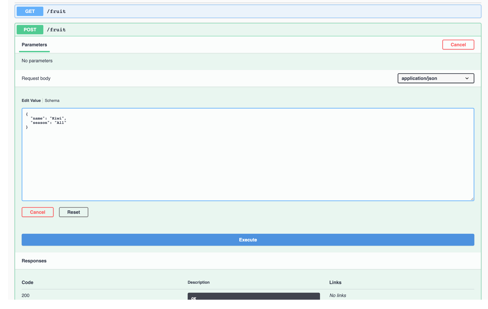

# Atomic Fruit Service

This is sample Fruit service generated from a maven artifact that generates all the needed Java scaffold for a Quarkus Maven app.

> Don't worry, there's also a Gradle counterpart ;-)

# Prerequisites

> **NOTE 1:** Change to the cloned folder.

> **NOTE 2:** You need JDK 8 or 11

## Setting demo environment variables

> *You can alternatively run:* `$ . ./env.sh`

```sh
export PROJECT_NAME="atomic-fruit"
export APP_NAME="fruits-app"

export QUARKUS_VERSION="1.9.2.Final"

export GRAALVM_VERSION="20.2.0"
GRAALVM_HOME=$(pwd)/graalvm-ce-java11-${GRAALVM_VERSION}
if [[ "$OSTYPE" == "darwin"* ]]; then GRAALVM_HOME=${GRAALVM_HOME}/Contents/Home ; fi
export GRAALVM_HOME
export PATH=${GRAALVM_HOME}/bin:$PATH

if [[ "$OSTYPE" == "linux"* ]]; then GRAALVM_OSTYPE=linux ; fi
if [[ "$OSTYPE" == "darwin"* ]]; then GRAALVM_OSTYPE=darwin ; fi
export GRAALVM_OSTYPE

export KNATIVE_CLI_VERSION="0.17.0"
if [[ "$OSTYPE" == "linux"* ]]; then KNATIVE_OSTYPE=Linux ; fi
if [[ "$OSTYPE" == "darwin"* ]]; then KNATIVE_OSTYPE=Darwin ; fi
export KNATIVE_OSTYPE

export TEKTON_CLI_VERSION="0.13.0"
if [[ "$OSTYPE" == "linux"* ]]; then TEKTON_OSTYPE=Linux ; fi
if [[ "$OSTYPE" == "darwin"* ]]; then TEKTON_OSTYPE=Darwin ; fi
export TEKTON_OSTYPE

mkdir -p ./bin
export PATH=$(pwd)/bin:$PATH
```

## Download GraalVM and set GraaVM env

Now download GraalVM for your system...

```sh
curl -OL https://github.com/graalvm/graalvm-ce-builds/releases/download/vm-${GRAALVM_VERSION}/graalvm-ce-java11-${GRAALVM_OSTYPE}-amd64-${GRAALVM_VERSION}.tar.gz
tar xvzf graalvm-ce-java11-${GRAALVM_OSTYPE}-amd64-${GRAALVM_VERSION}.tar.gz
```

## Install native image for GraalVM

```sh
gu install native-image
```

## Login to your Openshift cluster

```sh
oc login ...
```

## Create a project or use an already existing one

```sh
oc new-project ${PROJECT_NAME}
```

# Generate the Quarkus app scaffold using a maven archetype

```sh
mvn io.quarkus:quarkus-maven-plugin:$QUARKUS_VERSION:create \
  -DprojectGroupId="com.redhat.atomic.fruit" \
  -DprojectArtifactId="atomic-fruit-service" \
  -DprojectVersion="1.0-SNAPSHOT" \
  -DclassName="FruitResource" \
  -Dpath="fruit"
```

# Testing different ways of packaging the app

> You must be inside the project folder to run the following commands.

```sh
cd atomic-fruit-service
```

## JVM mode

This mode generates a Quarkus Java jar file.

```sh
./mvnw -DskipTests clean package
```

Run the application in JVM mode.

```sh
java -jar ./target/atomic-fruit-service-1.0-SNAPSHOT-runner.jar
```

Test from another terminal or a browser, you should receive a `hello` string.

```sh
curl http://localhost:8080/fruit
```

Ctrl+C to stop.

## Native Mode I

This mode generates a Quarkus native binary file.

> **NOTE:** This is huge... now you have a native binary file, no JVM involved.

```sh
./mvnw -DskipTests clean package -Pnative
```

Run the application in native mode.

```sh
./target/atomic-fruit-service-1.0-SNAPSHOT-runner
```

Test from another terminal or a browser, you should receive a `hello` string.

```sh
curl http://localhost:8080/fruit
```

Ctrl+C to stop.

## Native Mode II (generated in a container)

This mode generates a Quarkus native binary file using a build image and builds an image with it.

> **NOTE:** If you want to use Mandrel...
> 
> ```
> ./mvnw package -Pnative -Dquarkus.native.container-build=true -Dquarkus.native.builder-image=quay.io/quarkus/ubi-quarkus-mandrel:{mandrel-flavor}
> ```

> **NOTE 2:**
>
> If you want/need to set the container runtime you can use `-Dquarkus.native.container-runtime=(podman/docker)`
> 
> For instance to use `podman` (then use `podman` to build the image, etc.):
> ```
> ./mvnw package -DskipTests -Pnative -Dquarkus.native.container-build=true -Dquarkus.native.container-runtime=podman
> ```

```sh
./mvnw package -DskipTests -Pnative -Dquarkus.native.container-build=true
docker build -f src/main/docker/Dockerfile.native -t atomic-fruit-service:1.0-SNAPSHOT .
```

Run the image created.

```sh
docker run -i --rm -p 8080:8080 atomic-fruit-service:1.0-SNAPSHOT
```

Test from another terminal or a browser, you should receive a `hello` string.

```sh
curl http://localhost:8080/fruit
```

Ctrl+C to stop.

Push it to the image registry of your choice.

```sh
docker tag atomic-fruit-service:1.0-SNAPSHOT quay.io/<registry_user>/atomic-fruit-service:1.0-SNAPSHOT
docker push quay.io/<registry_user>/atomic-fruit-service:1.0-SNAPSHOT
```

# Automatic build for JVM mode using `docker`

With automatic builds we have to set `registry` and `group` to tag the image for pushing to the registry. Add these properties to the `application.properties` files or add them using `-D`.

```properties
# OCI Image
quarkus.container-image.registry=<registry>
quarkus.container-image.group=<registry_user>
```

> **NOTE:** Extentions for building images [here](https://quarkus.io/guides/container-image)

> **WARNING:** For now you cannot use `podman` in this case... :-( [this](https://github.com/quarkusio/quarkus/blob/master/extensions/container-image/container-image-docker/deployment/src/main/java/io/quarkus/container/image/docker/deployment/DockerProcessor.java) is the culprit.

```sh
./mvnw quarkus:add-extension -Dextensions="container-image-docker"
./mvnw package -Dquarkus.native.container-build=true -Dquarkus.container-image.build=true
```

Run the image created.

```sh
docker run -i --rm -p 8080:8080 <registry>/<registry_user>/atomic-fruit-service:1.0-SNAPSHOT
```

Test from another terminal or a browser, you should receive a `hello` string.

```sh
curl http://localhost:8080/fruit
```

Ctrl+C to stop.

# Automatic build for Native mode using `docker`

> **NOTE:** Extentions for building images [here](https://quarkus.io/guides/container-image). 

> **WARNING:** For now you cannot use `podman` in this case... :-( [this](https://github.com/quarkusio/quarkus/blob/master/extensions/container-image/container-image-docker/deployment/src/main/java/io/quarkus/container/image/docker/deployment/DockerProcessor.java) is the culprit.

```
./mvnw quarkus:add-extension -Dextensions="container-image-docker"
./mvnw package -Pnative -Dquarkus.native.container-build=true -Dquarkus.container-image.build=true
```

Run the image created.

```sh
docker run -i --rm -p 8080:8080 <registry>/<registry_user>/atomic-fruit-service:1.0-SNAPSHOT
```

Test from another terminal or a browser, you should receive a `hello` string.

```sh
curl http://localhost:8080/fruit
```

Ctrl+C to stop.

# Running in development mode and enjoy hot reloading

We can run our app in development mode, to do so we have to do as follows:

> **NOTE:** In this case we're using the `dev` profile

```sh
./mvnw quarkus:dev
```

As we have done several times before, from a different terminal or using a browser try this url: http://localhost:8080/fruit

Now, without stopping our application, let's add some logging...

# Adding log capabilities

You can configure Quarkus logging by setting the following parameters to `$PROJECT_HOME/src/main/resources/application.properties`:

```properties
# Enable logging
quarkus.log.console.enable=true
quarkus.log.console.level=DEBUG

# Log level settings
quarkus.log.category."com.redhat.atomic".level=DEBUG
```

Update `$PROJECT_HOME/src/main/java/com/redhat/atomic/fruit/FruitResource.java` with the relevant lines bellow.

```java
...
import org.jboss.logging.Logger; // logging

public class FruitResource {
  Logger logger = Logger.getLogger(FruitResource.class); // logging
  ...

  @GET
  @Produces(MediaType.TEXT_PLAIN)
  public String hello() {
      logger.debug("Hello method is called"); // logging
      return "hello";
  }
...
}
```

# Adding custom properties

Add the following to the class you want to use your custom property.

```java
...
import org.eclipse.microprofile.config.inject.ConfigProperty;

@Path("/fruit")
public class FruitResource {

  @ConfigProperty(name = "hello.message")
  String message;
  
  @GET
  @Produces(MediaType.TEXT_PLAIN)
  public String hello() {
      logger.debug("Hello method is called with message: " + this.message); // logging & custom property
      return message; // custom property
  }
...
}
```

Add the following property to your application.properties.

```properties
# custom properties
hello.message = ${HELLO_MESSAGE:hello}
```

Now, without stopping our application, change the value of `hello.message` from hello to something different. Save the aplication.propertlies file and try again. This time the result should be different.

**WARNING:** Return the value of `hello.message` back to `hello` and stop the app with Ctrl+C

# Adding a Data Base to our application

## Deploying PostgreSQL

We're going to deploy PostgreSQL using a template, in general an operator is a better choice but for the sake of simplicity in this demo a template is a good choice.

Using `oc`

```sh
oc new-project ${PROJECT_NAME}
oc new-app -e POSTGRESQL_USER=luke -e POSTGRESQL_PASSWORD=secret -e POSTGRESQL_DATABASE=my_data centos/postgresql-10-centos7 --name=my-database -n ${PROJECT_NAME}
```

Some labeling specially useful for OpenShift developer view.

```sh
oc label deployment/my-database app.openshift.io/runtime=postgresql --overwrite -n ${PROJECT_NAME} && \
oc label deployment/my-database app.kubernetes.io/part-of=${APP_NAME} --overwrite -n ${PROJECT_NAME}
```

## Adding DB related extensions

We need some extensions to expose our database to the world: REST JSON, PostgreSQL and Panache Hibernate as our ORM.

```sh
./mvnw quarkus:add-extension -Dextension="quarkus-resteasy-jsonb, quarkus-jdbc-postgresql, quarkus-hibernate-orm-panache"
```

You should see something like this when you add succesfully extensions to an app.

```sh
...
[INFO] --- quarkus-maven-plugin:0.23.1:add-extension (default-cli) @ atomic-fruit-service ---
✅ Adding extension io.quarkus:quarkus-resteasy-jsonb
✅ Adding extension io.quarkus:quarkus-jdbc-postgresql
✅ Adding extension io.quarkus:quarkus-hibernate-orm-panache
...
```

## Let's create the `Fruit` entity

Create this file here `$PROJECT_HOME/src/main/java/com/redhat/atomic/fruit/Fruit.java`

Add this content to it.

```java
package com.redhat.atomic.fruit;

import java.util.List;

import javax.persistence.Entity;

import io.quarkus.hibernate.orm.panache.PanacheEntity;

@Entity
public class Fruit extends PanacheEntity {

    public String name;
    public String season;

    public static List<Fruit> getAllFruitsForSeason(String season) {
        return find("season", season).list();
    }
}
```

As you can see our `Fruit` class extends `PanacheEntity` which adds the default **CRUD** methods you can expects from an **ORM framework** such as **Panache**. How ever it doesn't add any custom methods. In this case we want to be able to search by season and that's the reason we have added a methos called `getAllFruitsForSeason`.

## Let's CRUDify our REST enabled service class FruitResource

What we want to do is easy:

* Return all the fruit if **GET** `/fruit`
* Save a Fruit if **POST** `/fruit`
* Search fruit if a given season if **GET** `/fruit/{season}`

```java
package com.redhat.atomic.fruit;

import java.net.URI;
import java.util.List;

import javax.transaction.Transactional;
import javax.ws.rs.Consumes;
import javax.ws.rs.GET;
import javax.ws.rs.POST;
import javax.ws.rs.Path;
import javax.ws.rs.PathParam;
import javax.ws.rs.Produces;
import javax.ws.rs.core.MediaType;
import javax.ws.rs.core.Response;
import javax.ws.rs.core.UriBuilder;

import org.eclipse.microprofile.config.inject.ConfigProperty;
import org.jboss.logging.Logger;

@Path("/fruit")
@Produces(MediaType.APPLICATION_JSON)
@Consumes(MediaType.APPLICATION_JSON)
public class FruitResource {
    Logger logger = Logger.getLogger(FruitResource.class);

    @ConfigProperty(name = "hello.message")
    String message;
    
    @GET
    @Path("hello")
    @Produces(MediaType.TEXT_PLAIN)
    public String hello() {
        logger.debug("Hello method is called with message: " + this.message); // logging & custom property
        return message; // custom property
    }
    
    @GET
    public List<Fruit> allFruits() {
        return Fruit.listAll(); 
    }

    @GET
    @Path("{season}")
    public List<Fruit> fruitsBySeason(@PathParam("season") String season) {
        return Fruit.getAllFruitsForSeason(season);
    }

    @POST
    @Transactional
    public Response saveFruit(Fruit fruit) {
        // since the FruitEntity is a panache entity
        // persist is available by default
        fruit.persist();
        final URI createdUri = UriBuilder.fromResource(FruitResource.class)
                        .path(Long.toString(fruit.id))
                        .build();
        return Response.created(createdUri).build();
    }
}
```

We need to adapt the test class after the changes to `FruitResource`. Update `$PROJECT_HOME/src/test/java/com/redhat/atomic/fruit/FruitResourceTest.java` with the next code.

```java
package com.redhat.atomic.fruit;

import io.quarkus.test.junit.QuarkusTest;
import org.junit.jupiter.api.Test;

import static io.restassured.RestAssured.given;
import static org.hamcrest.CoreMatchers.is;

@QuarkusTest
public class FruitResourceTest {

    @Test
    public void testHelloEndpoint() {
        given()
          .when().get("/fruit/hello")
          .then()
             .statusCode(200)
             .body(is("hello"));
    }

}
```

## Adding datasource related properties

Add the following properties to your `./src/main/resources/application.properties` file:

> **NOTE:** As you can see we have three different jdbc urls for three execution profiles (`dev`, `prod` the default and `che` a custom profile we'll use later)

```properties
# Data Base related properties

quarkus.datasource.jdbc.url = jdbc:postgresql://my-database:5432/my_data
quarkus.datasource.db-kind=postgresql

%dev.quarkus.datasource.jdbc.url = jdbc:postgresql://localhost:5432/my_data
%dev.quarkus.datasource.db-kind=postgresql
#%dev.quarkus.datasource.jdbc.url = jdbc:h2:mem:myDB
#%dev.quarkus.datasource.db-kind=h2
#%dev.quarkus.datasource.username = username-default
#%test.quarkus.datasource.jdbc.url = jdbc:h2:mem:myDB
#%test.quarkus.datasource.db-kind=h2
#%test.quarkus.datasource.username = username-default

quarkus.datasource.username = luke
quarkus.datasource.password = secret

# drop and create the database at startup (use `update` to only update the schema)
%dev.quarkus.hibernate-orm.database.generation = drop-and-create
quarkus.hibernate-orm.database.generation = create
quarkus.hibernate-orm.sql-load-script = import.sql
# show sql statements in log
quarkus.hibernate-orm.log.sql = true
```

## Adding some fruits

Create a file called `import.sql` here `./src/main/resources`

This is a suitable content for that file.

```sql
INSERT INTO Fruit(id,name,season) VALUES ( nextval ('hibernate_sequence') , 'Mango'      , 'Spring' );
INSERT INTO Fruit(id,name,season) VALUES ( nextval ('hibernate_sequence') , 'Strawberry' , 'Spring' );
INSERT INTO Fruit(id,name,season) VALUES ( nextval ('hibernate_sequence') , 'Orange'     , 'Winter' );
INSERT INTO Fruit(id,name,season) VALUES ( nextval ('hibernate_sequence') , 'GrapeFruit' , 'Winter' );
INSERT INTO Fruit(id,name,season) VALUES ( nextval ('hibernate_sequence') , 'Blueberry'  , 'Summer' );
INSERT INTO Fruit(id,name,season) VALUES ( nextval ('hibernate_sequence') , 'Banana'     , 'Summer' );
INSERT INTO Fruit(id,name,season) VALUES ( nextval ('hibernate_sequence') , 'Plum'       , 'Summer' );
INSERT INTO Fruit(id,name,season) VALUES ( nextval ('hibernate_sequence') , 'Apple'      , 'Fall'   );
INSERT INTO Fruit(id,name,season) VALUES ( nextval ('hibernate_sequence') , 'Grape '     , 'Fall'   );
```

## Testing locally using port-forwarding

In a different terminal...

> **NOTE 1:** Load environment as we did before `. ./env.sh` or just substitute `PROJECT_NAME` accordingly
> **NOTE 2:** If using `oc` you may want to set the default project to ${PROJECT_NAME}: `oc project ${PROJECT_NAME}`

```sh
POD_NAME=$(oc get pod -n ${PROJECT_NAME} -o jsonpath='{.items[0].metadata.name}')
oc port-forward ${POD_NAME} 5432:5432 -n ${PROJECT_NAME} 
```

In your current terminal run your code using profile `dev`

> **NOTE 1:** When you run you're app in `dev` mode `dev` profile is activated by default.

> **NOTE 2:** Later we'll need to run `che`, we'll do it by adding: `-Dquarkus.profile=che`

```sh
./mvnw compile quarkus:dev
```

If you use another terminal and try this url: http://localhost:8080/fruit this time you should get a list of fruits.

```sh
curl http://localhost:8080/fruit
[{"id":1,"name":"Mango","season":"Spring"},{"id":2,"name":"Strawberry","season":"Spring"},{"id":3,"name":"Orange","season":"Winter"},{"id":4,"name":"GrapeFruit","season":"Winter"},{"id":5,"name":"Blueberry","season":"Summer"},{"id":6,"name":"Banana","season":"Summer"},{"id":7,"name":"Plum","season":"Summer"},{"id":8,"name":"Apple","season":"Fall"},{"id":9,"name":"Grape ","season":"Fall"}]
```

We're done with the PostgreSQL tests, now go to the terminal window where we forwaded the database port and stop it with Ctrl+C

Leave the application running we're going to do some more changes.

### Little diversion: Using H2

What if you wanted to use H2, the embedded database when in `dev` mode?

First let's add the extension.

> Adding H2

```sh
./mvnw quarkus:add-extension -Dextension="io.quarkus:quarkus-jdbc-h2"
[INFO] Scanning for projects...
[INFO] 
[INFO] ------------< com.redhat.atomic.fruit:atomic-fruit-service >------------
[INFO] Building atomic-fruit-service 1.0-SNAPSHOT
[INFO] --------------------------------[ jar ]---------------------------------
[INFO] 
[INFO] --- quarkus-maven-plugin:0.23.1:add-extension (default-cli) @ atomic-fruit-service ---
✅ Adding dependency io.quarkus:quarkus-jdbc-h2:jar
[INFO] ------------------------------------------------------------------------
[INFO] BUILD SUCCESS
[INFO] ------------------------------------------------------------------------
[INFO] Total time:  1.606 s
[INFO] Finished at: 2019-10-13T15:37:52+02:00
[INFO] ------------------------------------------------------------------------
```

Second, change some datasource related properties in `application.properties`

> **Notice** that we have changed the value of `dev.quarkus.datasource.url` now the url points to H2 instead of PostgreSQL, so no need to port-forward our DB running in our cluster.

```properties
#%dev.quarkus.datasource.jdbc.url = jdbc:postgresql://localhost:5432/my_data
#%dev.quarkus.datasource.db-kind=postgresql
%dev.quarkus.datasource.jdbc.url = jdbc:h2:mem:myDB
%dev.quarkus.datasource.db-kind=h2
%dev.quarkus.datasource.username = username-default
%test.quarkus.datasource.jdbc.url = jdbc:h2:mem:myDB
%test.quarkus.datasource.db-kind=h2
%test.quarkus.datasource.username = username-default
```

If, accidentally, you stopped the application you can run it again using profile `dev` running the next command. However this time the application will run queries against H2.

```sh
./mvnw compile quarkus:dev
```

As we have done before, from another terminal run:

```sh
curl http://localhost:8080/fruit
[{"id":1,"name":"Mango","season":"Spring"},{"id":2,"name":"Strawberry","season":"Spring"},{"id":3,"name":"Orange","season":"Winter"},{"id":4,"name":"GrapeFruit","season":"Winter"},{"id":5,"name":"Blueberry","season":"Summer"},{"id":6,"name":"Banana","season":"Summer"},{"id":7,"name":"Plum","season":"Summer"},{"id":8,"name":"Apple","season":"Fall"},{"id":9,"name":"Grape ","season":"Fall"}]
```

## Test creating a fruit

Let's try to create a Fruit object in our database.

```sh
curl -vvv -d '{"name": "banana", "season": "summer"}' -H "Content-Type: application/json" POST http://localhost:8080/fruit
* Rebuilt URL to: POST/
* Could not resolve host: POST
* Closing connection 0
curl: (6) Could not resolve host: POST
*   Trying ::1...
* TCP_NODELAY set
* Connected to localhost (::1) port 8080 (#1)
> POST /fruit HTTP/1.1
> Host: localhost:8080
> User-Agent: curl/7.54.0
> Accept: */*
> Content-Type: application/json
> Content-Length: 38
> 
* upload completely sent off: 38 out of 38 bytes
< HTTP/1.1 201 Created
< Location: http://localhost:8080/fruit/1
< Content-Length: 0
< 
* Connection #1 to host localhost left intact
```

## Adding Swagger UI to ease API development and testing

You can easily generate en OpenAPI compliant description of your API and at additionally add a Swagger UI to your app by adding the `openapi` extension. Please run this command to do so.

```sh
./mvnw quarkus:add-extension -Dextensions="quarkus-smallrye-openapi"
```

Try opening this url http://localhost:8080/swagger-ui with a browser you should see something like:


## Try creating another Fruit this time with the Swagger UI

Try to create a new fruit, get all and get by season.

Click on **POST /fruit** then click on **Try it out**

> **WARNING:** Don't forget to delete the `id` property when creating a new fruit because `id` is self-generated.



Now click on **Execute** eventually you should get a result similar to this one.

> Pay attention to **Code**, it should be **201**.


## Adding health checks

Health checks is one of those things that if recommendable in general is a must for every Cloud Native App and in quarkus it's a extension so let's add it.

```sh
./mvnw quarkus:add-extension -Dextension="smallrye-health"
```

Make sure your application is running in `dev` mode, then test the `/health` endpoint like this:

```sh
curl http://localhost:8080/health

{
    "status": "UP",
    "checks": [
        {
            "name": "Database connections health check",
            "status": "UP"
        }
    ]
}
```

Ctrl+C

# Different deployment techniques

## Deploying to OpenShift

First of all let's add the extension to deploy to OpenShift.

```sh
./mvnw quarkus:add-extension -Dextension="openshift"
```

Second let's remove the docker extension, we don't need it and they collide with each other.

```sh
./mvnw quarkus:remove-extension -Dextension="container-image-docker"
```

Add this couple of properties to `application.properties` so that we trust on the CA cert and set the namespace where we want to deploy our application.

```properties
# Kubernetes Client
quarkus.kubernetes-client.trust-certs=true
quarkus.kubernetes-client.namespace=${PROJECT_NAME:atomic-fruit}

# Only generate OpenShift descriptors
quarkus.kubernetes.deployment-target=openshift

# Expose the service when deployed
quarkus.openshift.expose=true
```

Now we don't want to create the image locally, we want OpenShift build it using S2I, hence we shouldn't set the image group or registry, right? Find the next properties and comment them.

```properties
# OCI Image
#quarkus.container-image.registry=<registry>
#quarkus.container-image.group=<registry_user>
```

Let's add a some additional labels `part-of` and `name`, and a custom label:

```properties
# Recommended labels and a custom label for kubernetes and openshift
quarkus.openshift.part-of=fruits-app
quarkus.openshift.name=atomic-fruit-service
quarkus.openshift.labels.department=fruity-dept
```

Regarding annotations, out of the box, the generated resources will be annotated with version control related information that can be used either by tooling, or by the user for troubleshooting purposes.

```yaml
annotations:
  app.quarkus.io/vcs-url: "<some url>"
  app.quarkus.io/commit-id: "<some git SHA>"
```

Let's add a custom annotation:

```properties
# Custom annotations
quarkus.openshift.annotations."app.openshift.io/connects-to"=my-database
quarkus.openshift.annotations.foo=bar
quarkus.openshift.annotations."app.quarkus/id"=42
```

So far we haven't prepared the production profile, for instance we have no secret to keep the database credentials. Let's do something about it. Let's create a secret locally first.

> NOTE: `openshift` extension takes the file we're generating and merge it with the one generated 

```sh
mkdir -p ./src/main/kubernetes
cat <<EOF > ./src/main/kubernetes/openshift.yml
---
apiVersion: v1
kind: Secret
metadata:
  name: fruits-database-secret
stringData:
  user: luke
  password: secret
EOF
```

Now let's add the environment variables we need to connect to the database:

```properties
# Environment variables
quarkus.openshift.env.mapping.db-username.from-secret=fruits-database-secret
quarkus.openshift.env.mapping.db-username.with-key=user
quarkus.openshift.env.mapping.db-password.from-secret=fruits-database-secret
quarkus.openshift.env.mapping.db-password.with-key=password
```

Let's package our application and have a look to the descriptors generated.

```
./mvnw package
```

Go to [`./target/kubernetes/openshift.yml`](./target/kubernetes/openshift.yml) there you'll find: Service and Deployment...

Let's deploy the result.

```sh
./mvnw clean package -Dquarkus.kubernetes.deploy=true -DskipTests
```

Or

```sh
$ kubectl apply -n ${PROJECT_NAME} -f target/kubernetes/openshift.yml
```

Let's inspect the resources created.

```sh
$ oc get dc -n ${PROJECT_NAME}
NAME                   READY   UP-TO-DATE   AVAILABLE   AGE
atomic-fruit-service   1/1     1            1           73s
my-database            1/1     1            1           89m
```

Now we can test that everything works properly.

```sh
curl http://$(oc get route atomic-fruit-service -o jsonpath='{.spec.host}')/fruit
```

What about native in this case? Easy, just add `-Dquarkus.native.container-build=true -Pnative`.

```sh
./mvnw clean package -Dquarkus.kubernetes.deploy=true -DskipTests -Dquarkus.native.container-build=true -Pnative
```

# Deploy to OpenShift as a Knative service

Let's add a new target platform...

```properties
# Generate OpenShift and Knative descriptors
quarkus.kubernetes.deployment-target=openshift,knative
```

And this properties to change the 

```properties
# Knative
quarkus.container-image.registry=image-registry.openshift-image-registry.svc:5000
quarkus.container-image.group=atomic-fruit
quarkus.container-image.tag=1.0-SNAPSHOT
quarkus.knative.name=atomic-fruit-service-kn
quarkus.knative.version=1.0
quarkus.knative.part-of=fruits-app
quarkus.knative.annotations."app.openshift.io/connects-to"=my-database
quarkus.knative.labels."app.openshift.io/runtime"=quarkus
quarkus.knative.env.mapping.db-username.from-secret=fruits-database-secret
quarkus.knative.env.mapping.db-username.with-key=user
quarkus.knative.env.mapping.db-password.from-secret=fruits-database-secret
quarkus.knative.env.mapping.db-password.with-key=password
```

kubectl apply -f target/kubernetes/knative.json


